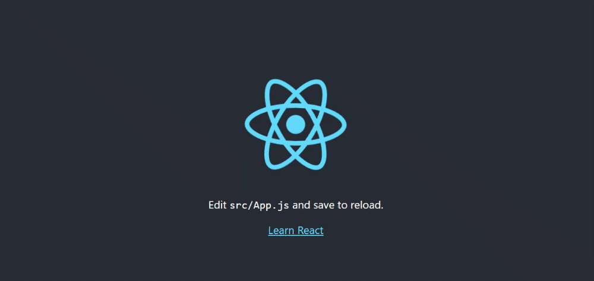

author: Henry Alexander Cortez Amaya
id: ProgramacionWeb-codelab-071121
summary: Creacion de aplicación de React
tags: workshop, iguide
categories: codelab,markdown
environments: Web
status: Published
analytics account: Google Analytics ID

# Crear una aplicación de React

## Bienvenida

Duration: 0:05:00

En este codelab aprenderás a como iniciar una aplicación de react usando diferentes empaquetadores.

### Resultado esperado



### ¿Qué aprenderás?

- Crear una aplicación de React.
- Conocer diferentes empaquetadores.

### Pre requisitos

- Node instalado (nvm recomendado).

## Iniciar una aplicación de React

Para instalar una aplicación de React es necesario poseer una versión de **Node** superior a 14.0.0. Si no se tiene instalado **Node** es recomendable realizar dicha instalación utilizando [nvm](https://hencor2019.github.io/nvm-guide/HenCor2019-codelab-260921/index.html#0). También es recomendable utilizar las versiones **LTS** ya que son versiones estables y podemos evitar problemas de compatibilidad. Para crear una aplicación de React podemos escoger diferentes métodos.

### npx (recomendada)

```console
npx create-react-app my-app
```

<aside class="positive">
npx se incluye en versiones npm 5.2 y superiores.
</aside>

<aside class="positive">
NOTA: npx descarga de manera temporal create-react-app y luego nos lo ejecuta de manera automática.
</aside>

### npm

Nos aseguramos de instalar **create-react-app** con **npm** de manera global

```console
npm install -g create-react-app
```

Iniciamos una aplicación de React ejecutando.

```console
create-react-app my-app
```

### yarn

**yarn** es un manejador de paquetes distribuido por Facebook. Instalamos el paquete con el siguiente comando.

```console
npm install --global yarn
```

Verificamos que se haya instalado de manera exitosa.

```console
yarn --version
```

Ahora ejecutamos el siguiente comando para iniciar una aplicación de React con **yarn**.

```console
yarn create react-app my-app
```

## Ruta de directorios

Independientemente del manejador de paquetes que hayamos usado, se nos creara una carpeta **my-app** dentro de la carpeta donde ejecutamos el comando. Dentro del cual se creará la estructura inicial del proyecto con las dependencias previamente instaladas.

```console
my-app
├── README.md
├── node_modules
├── package.json
├── .gitignore
├── public
├── ├── favicon.ico
├── ├── index.html
├── └── manifest.json
└── src
    ├── App.css
    ├── App.js
    ├── App.test.js
    ├── index.css
    ├── index.js
    ├── logo.svg
    └── serviceWorker.js
    └── setupTests.js
```

<aside class="positive">
Create React App evita la creación de archivos innecesarios. Dejando únicamente los archivos necesarios para compilar la aplicación. Una vez realizada la instalación debemos cambiar al directorio.
</aside>

```console
cd my-app
```

## Iniciar la aplicación

### npm

Si se utilizó **npx** o **npm** para crear nuestra aplicación de React, ejecutar.

```console
npm start
```

### yarn

Si se utilizó **yarn** como manejador de paquetes iniciaremos nuestra aplicación con el siguiente comando.

```console
yarn start
```

<aside class="positive">
NOTA: Por defecto React ocupa el puerto 3000 para construir nuestra aplicación de manera local.
</aside>

### Resultado


### Incluir tailwind en React

Si deseas incluir **tailwind** en tu aplicación de React, te recomendamos el siguiente codelab de como [incluir Tailwind](https://carolinamcc15.github.io/tailwind-guide/#0) en tu aplicación.

## Completaste el codelab


### Has finalizado la instalacion de React, esperamos te haya sido de mucha ayuda.

### ¡Continúa practicando!⭐
