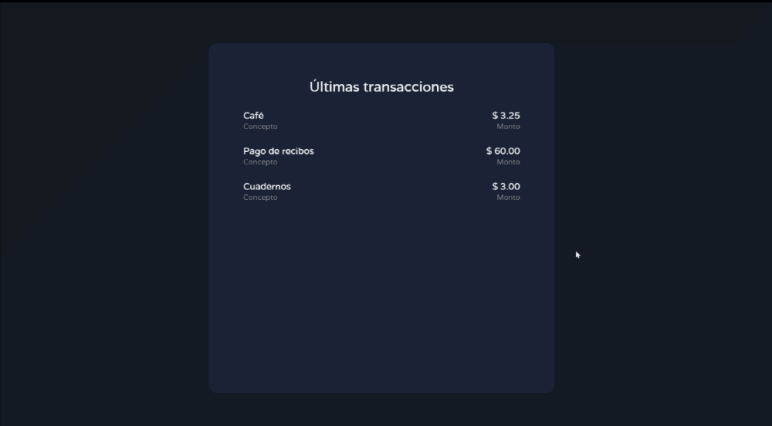
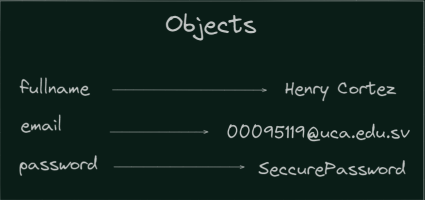
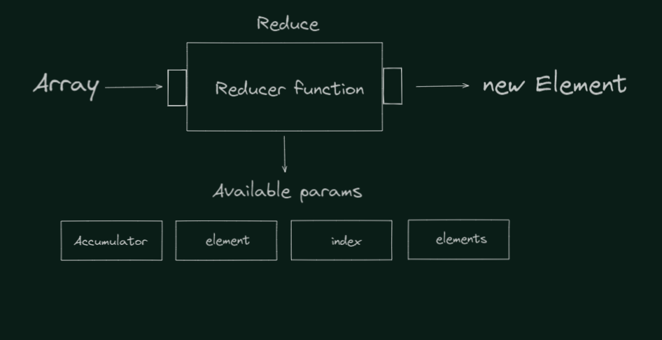

author: Henry Alexander Cortez Amaya
id: ProgramacionWeb-codelab-171021
summary: Ejercicio js principiantes
tags: workshop, iguide
categories: codelab,markdown
environments: Web
status: Published
analytics account: Google Analytics ID

# Control de mis finanzas

## Bienvenida

Duration: 0:05:00

En este curso aprenderás acerca de cómo manejar el DOM en JavaScript de manera fácil y sencilla, crear estructuras de datos personalizadas, además de delegar eventos a etiquetas para la realización de funcionalidades controladas.

### Resultado esperado



### ¿Qué aprenderás?

- Manejo de DOM en JavaScript.
- Manejo de eventos en formularios.
- Introducción a la programación funcional.
- Renderizar condicionalmente elementos
- Renderizar listas de manera dinámica.

## Configuración del entorno

Duration: 0:10:00

### IDE

El editor de texto a trabajar será Visual Studio Code, si no tienes instalado dicho editor lo puedes descargar desde el siguiente [enlace](https://code.visualstudio.com/).

### Clonar el repositorio base

Asumimos que tienes instalado [git](https://git-scm.com/), clona el repositorio [base](https://github.com/Programacion-Web-0221-UCA/L01-JSDOM) de la siguiente manera en tu lugar de preferencia:

```console
git clone https://github.com/Programacion-Web-0221-UCA/L01-JSDOM.git
```

Después de clonar el repositorio accedemos a él mediante el comando:

```console
cd L01-JSDOM
```

### Archivos

En el repositorio encontrarás el archivo **index.html** junto a los estilos propuestos en el archivo **styles.css**.

## Parte 1 - Funciones lógicas

Duration: 0:15:00

### Introducción

Las funciones lógicas son aquellas que nos indican cómo será el funcionamiento de nuestro programa, además de indicar la estructura de nuestras variables.

### Objetivos

- Conocimiento de variables globales.
- Uso correcto de objectos o diccionarios.

### Variables globales y su composición

Declara al inicio del archivo **main.js** una variable llamada **transactions**, la cual nos ayudará a guardar todas las transacciones que se ingresen en nuestra página web.

<aside class="negative">
NOTA: **transactions** deberá ser un arreglo, ya que necesitamos guardar numerosas transacciones.
</aside>

### Objetos o diccionarios

Lo objectos o diccionarios son elementos no primitivos compuestos por una clave-valor que nos ayudan a almacenar en un mismo contenedor diferentes elementos diferenciados por una llave única, la cual contendrá un dato ingresado.

A continuación se ejemplifica de manera gráfica un objeto en Javascript:



### Agregando una transacción

Declararemos una función llamada `addTransaction` que nos ayudará a manejar la lógica de agregar una nueva transacción a nuestro arreglo.
Para ello necesitamos definir que será una transacción, la cual cuenta con tres características principales:

1. Un identificador único.
2. Un concepto.
3. Un monto.

Con esto en mente declararemos un objecto que se encargará de contener dichos atributos.

```javascript
const addTransaction = (concept, amount) => {
  const newTransaction = {
    id: `Tsc_${new Date().getTime()}`,
    concept: concept,
    amount: Number(amount),
  };

  transactions.unshift(newTransaction);
};
```

<aside class="negative">
NOTA: El método unshift en array agrega un elemento al igual que push, con la diferente que el nuevo elemento será agregado al inicio, no al final.
</aside>

### Validación de campos

Para evitar posibles errores, es necesario validar una transacción antes de que esta sea agregada, para lo cual es necesario asegurar lo siguiente:

- Que no se ingresen valores vacíos.
- Que el monto ingresado sea un número.

Para ello declararemos una función llamada **areValidFields**, la cual se encargará de verificar si los campos ingresados son válidos o no.

<aside class="positive">
NOTA: areValidFields devolverá un valor de tipo booleano que indicará si los valores son válidos o no.
</aside>

```javascript
const areValidFields = (concept, amount) => {
  if (!(concept && amount)) return false;

  const amountNumber = Number(amount);

  if (isNaN(amountNumber)) return false;

  return true;
};
```

<aside class="positive">
NOTA: isNaN es una función que proveen los navegadores para verificar si el valor es un número válido.
</aside>

## Parte 2 - Funciones de renderización

Duration: 0:20:00

### Introducción

Las funciones de renderización nos ayudan a mostrar los cambios en pantalla a los usuarios.

### Objetivos

- Uso de programación funcional.
- Renderización condicional.

### Renderizar una transacción

Para mostrar de manera visual una transacción haremos uso de HTML para brindarle semántica y aplicar estilos de una manera más sencilla, para lo cual, se propone el siguiente diseño:


Para ello, declararemos una función llamada **renderListElement** la cual recibirá de manera dinámica los elementos que necesitemos renderizar:

```javascript
const renderListElement = (concept = "", amount = 0) => {
  return `
    <li>
        <div>
            <p>${concept}</p>
            <p>Concepto</p>
        </div>
                    
        <div>
            <p>$ ${amount.toFixed(2)}</p>
            <p>Monto</p>
        </div>
    </li>
    \n
    `;
};
```

<aside class="negative">
NOTA: El método toFixed se encarga de aproximar los decimales de un número, la cantidad de decimales a aproximar deberá ser pasada como parámetro.
</aside>

### Programación funcional: Reduce

Se necesita transformar nuestro arreglo de transacciones para que se muestren como elementos HTML renderizables, para lo cual podemos ocupar el método reduce que proveen los arreglos.

Reduce es un método que por defecto, nos provee una variable acumuladora que nos permite, como su nombre indica, reducir un arregla a una mínima expresión en base a una función indicada, una vista general de reduce es:


Ahora con el método reduce, podemos reducir cada elemento del array en un solo elemento renderizable, para lo cual nuestra **función reduce** retornará lo que tengamos acumulado concatenado con una nueva transacción en formato HTML.

<aside class="positive">
NOTA: Declaramos una variable acumuladora para conocer el total de deudas o activo.
</aside>

<aside class="negative">
NOTA: No es necesario declarar todos los parámetros que provee el método reduce.
</aside>

```javascript
let totalAmount = 0;
const transactionsHTML = transactions.reduce((acc, current) => {
  const { concept, amount } = current;

  totalAmount += amount;

  return acc + `${renderListElement(concept, amount)}`;
}, "");
```

### Renderizar todas las transacciones

Para renderizar nuestras transacciones manipularemos la etiqueta **ol** que se encuentra en nuestro **index.html**, la cual nos servirá como nuestro contenedor de transacciones. Para ello, haremos uso de los métodos **innerHTML** y **textContent** para mostrar todas las transacciones.

### Renderización condicional

En el caso que se detecten deudas, es decir, números negativos, se mostrará de manera visual dicha información. Esta información **está condicionada por el total de dinero**, por ello, se renderizará condicionalmente dicho parámetro.

#### Operador ternario

De manera clásica se puede lograr renderizar algo de manera condicional de la siguiente manera:

```javascript
if (totalAmount < 0) resultTitle.textContent = "Debes";
else resultTitle.textContent = "Tienes";
```

En este caso podemos notar que es una sentencia de código en ambos casos, para lo cual Javascript provee de un **operador ternario** que realiza la misma acción de una forma más compacta y eficiente:

```javascript
resultTitle.textContent = totalAmount < 0 ? "Debes" : "Tienes";
```

Logrando el mismo resultado que de la manera clásica.

### Función de renderización

Se declarará una función que englobe todos los procesos previamente mencionados:

```javascript
const renderTransactions = () => {
  const transactionsList = document.getElementById("transactions");
  const resultTitle = document.querySelector("#result-container h3");
  const resultAmount = document.querySelector("#result-container p");
  let totalAmount = 0;

  const transactionsHTML = transactions.reduce((acc, current) => {
    const { concept, amount } = current;

    totalAmount += amount;

    return acc + `${renderListElement(concept, amount)}`;
  }, "");

  transactionsList.innerHTML = transactionsHTML;

  resultTitle.textContent = totalAmount < 0 ? "Debes" : "Tienes";
  resultAmount.textContent = `$ ${totalAmount.toFixed(2)}`;
};
```

## Parte 3 - Listeners

Duration: 0:10:00

### Introducción

Los listeners son eventos que serán invocados cuando realicemos acciones específicas dentro de nuestra página, algunos eventos pueden ser:

- submit
- click
- hover
- drag
- drop

### Objetivos

- Uso de eventos en formularios.
- Uso de FormData en formularios HTML.

### Evento submit

Al poseer una etiqueta form en nuestro HTML, podemos hacer uso de el evento submit que equivale tanto a eventos **enter** en inputs como eventos **click** en botones. Manipulamos nuestro formulario y se asignamos el evento submit donde realizaremos los siguientes pasos

1. Obtener los valores de los inputs.
2. Verificar si los valores son válidos.
3. Crear y agregar la nueva transacción.
4. Mostrar todas las transacciones.

```javascript
const addFormListener = () => {
  const form = document.querySelector("#add-transaction-form");

  form.addEventListener("submit", (e) => {
    e.preventDefault();

    const data = new FormData(form);

    const conceptInput = data.get("concept");
    const amountInput = data.get("amount");

    if (!areValidFields(conceptInput, amountInput)) return;

    addTransaction(conceptInput, amountInput);
    renderTransactions();

    form.reset();
  });
};
```

<aside class="positive">
NOTA: e.preventDefault() prevee el evento por defecto de los formularios, con el cual evitamos que se recargue la página.
</aside>

<aside class="positive">
NOTA: FormData es una forma de trabajar formularios HTML en base a nombres, los cuales son colocados con el atributo name en inputs.
</aside>

### Iniciar nuestra App

Para iniciar nuestra app, se propone la siguiente estructura en código:

```javascript
const App = () => {
  addFormListener();
};

window.onload = App;
```

## Completaste el codelab


### Has finalizado el laboratorio 01, esperamos te haya sido de mucha ayuda.

### ¡Continúa practicando!⭐
