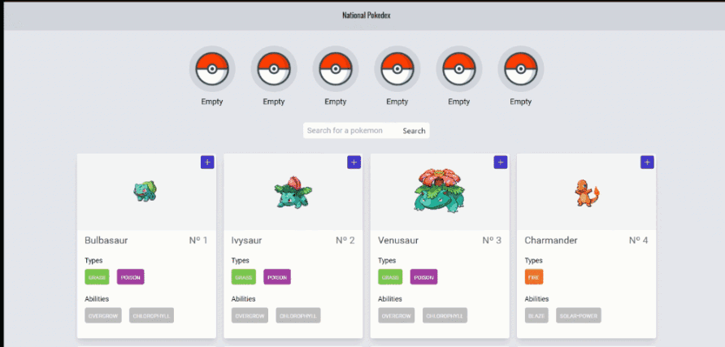
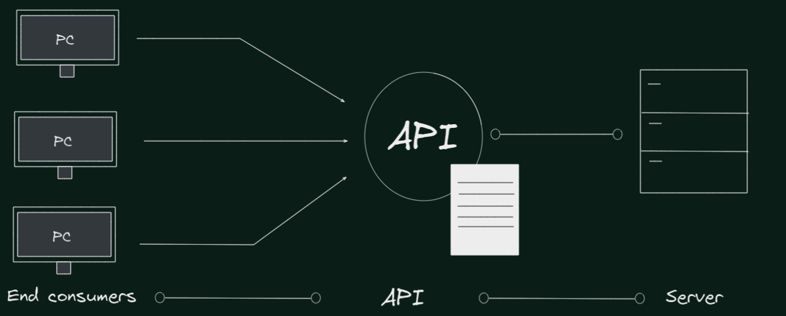
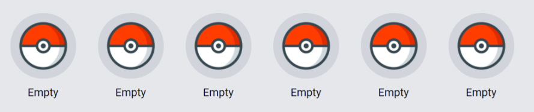
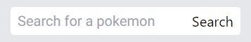
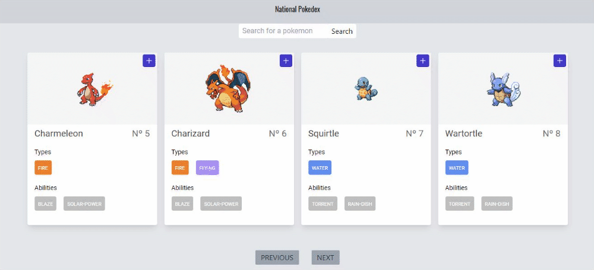

author: Henry Cortez, Fernando Batarsé, David Massana, Carolina Carranza
id: ProgramacionWeb-codelab-111021
summary: Laboratorio 03 consumiendo la PokeAPI
tags: workshop, iguide
categories: codelab,markdown
environments: Web
status: Published
analytics account: Google Analytics ID

# Mi Pokedex nacional

## ¡Bienvenidos/as!

Duration: 0:05:00

En este curso aprenderás el concepto de una API (Aplication Programming Interface) y cómo procesar los servicios que estas nos proveen. También aprenderás cómo usar diferentes hooks que provee React para manejar de manera dinámica las renderizaciones que se hacen sobre los diferentes servicios. Esta codelab lo guiará a través de una aplicación de la implementación de una [pokedex](https://www.pokemon.com/es/pokedex/) utilizando el framework de React, por lo que se tendrá una idea clara de como consumir una **API** y configurarla según nuestras necesidades.

### Lo que estaremos realizando

Nuestro objetivo es realizar una pokedex nacional con la ayuda de [pokeAPI](https://pokeapi.co/)

- Comenzaremos creando cada uno de los servicios que necesitaremos para renderizar nuestros **pokemons**.

- Crearemos los componenentes para mostrar los datos que solicitamos de nuestra **API** de prueba.



### ¿Qué aprenderás?

✅ Concepto de una **API**.

✅ Consumo de servicios de una **API**.

✅ Uso de **React hooks**.

✅ Estilos con tailwind.

## Configuración del entorno

Duration: 0:10:00

### IDE

El editor de texto a trabajar será Visual Studio Code, si no tienes instalado dicho editor lo puedes descargar desde el siguiente [enlace](https://code.visualstudio.com/).

### Clonar el repositorio base

Asumimos que tienes instalado [git](https://git-scm.com/), clona el repositorio [base](https://github.com/Programacion-Web-0221-UCA/L03-POKEAPI) de la siguiente manera en tu lugar de preferencia:

```console
git clone https://github.com/Programacion-Web-0221-UCA/L03-POKEAPI.git
```

Después de clonar el repositorio accedemos a él mediante el comando:

```console
cd L03-POKEAPI
```

### Archivos

En el repositorio encontrarás la siguiente estructura propuesta.

```console
my-app
├── README.md
├── node_modules
├── package.json
├── .gitignore
├── tailwind.config.js
├── craco.config.js
├── public
├── ├── favicon.ico
├── ├── index.html
├── └── manifest.json
└── src
    ├── App.css
    ├── App.js
    ├── App.test.js
    ├── index.css
    ├── index.js
    ├── logo.svg
    ├── serviceWorker.js
    ├── Constants
    ├── ├── Pokemon.js
    ├── Assets
    ├── ├── Img
    ├── ├── ├── pokemon.png
    └── setupTests.js
```

Archivos a destacar sobre la estructura

**Constants** Carpeta donde se alojan aquellos archivos que nunca cambiarán o tienen valores por defecto.

**Assets** Carpeta donde se alojan todo tipo de recursos visuales como imágenes, gif, etc.

### Instalación de dependencias

Al ser un proyecto con **React**, es necesario instalar todas las dependencias necesarias para que nuestro programa compile. Para ello, realizar

```console
npm i
```

<aside class="negative">
 NOTA: npm i es una manera abreviada de npm install
</aside>

### Iniciar nuestra aplicación

Para iniciar nuestra aplicación ejecutaremos el siguiente comando en la terminal

```console
npm start
```

<aside class="negative">
 NOTA: npm start provee un hot reload, lo que implica que podemos ejecutar cambios en nuestra aplicación mientras se encuentra en ejecución y visualizar dichos cambios.
</aside>

## ¿Qué es una API?

### Introducción

Una API, por sus siglas Aplication Programming Interface es un conjunto de definiciones y protocolos que utiliza para desarrollar e integrar el software de las aplicaciones.

Las API nos permiten comunicar nuestros servicios y productos con diferentes usuarios. Esto provee una reducción de tiempo y dinero al momento de desarrollar una aplicación con diferentes entornos.

### Objetivos

- Conocimiento de una API.
- Conocimiento de peticiones en API.
- Conocimineto de estructura REST.
- Introduccion a PokeAPI.



<aside class="negative">
A veces las API se consideran como contratos con documentación que representa un acuerdo entre las partes.
</aside>

<aside class="negative">
NOTA: La estructura que determina como responderá el software es la estructura enviada por la solicitud remota.
</aside>

### Ventajas de ocupar una API

Además de funcionar con un intermediario entre nuestros productos y usuarios finales, las **API** nos proveen ventajas sobre otras estructuras

✅ Otorgan flexibilidad.

✅ Simplifican el diseño y la administración.

✅ Su arquitectura proporciona oportunidades de innovación.

### Verbos en las API

Las API incluyen diferentes verbos para realizar todas las solicitudes remotas que necesitemos ya que una API no deja de ser una arquitectura para consultar o realizar acciones en productos o servicios, entre ellos se encuentran

- **GET**: Verbo utilizado para consultar un recurso. Una de las características principales de este verbo es la libertad de interacturar con acciones directas de un servidor, es decir, no causa efectos secundarios sobre este. Un ejemplo de un metodo GET puede ser **https:mydomain.com/users**, el cual está solicitando que se entregue el recurso conocido como **users**.

- **POST**: Las peticiones de tipo POST son comúnmente destinadas a la creación de nuevos recursos dentro de nuestro servidor. Un ejemplo de método POST sería **https://mydomain.com/users**, él necesitará a diferencia del metodo GET un cuerpo o datos extra para poder completarse.

- **PUT/PATCH**: Estos dos verbos son similares ya que ambos estan destinados a actualizar recursos ya existentes. Su diferente es que PUT reemplaza todo el recurso mientras que PATCH reemplaza aquellos datos que se deseen actualizar dejando los demas como estaban anteriormente.

<aside class="negative">
NOTA: No importa cuantas veces realicemos una petición GET, los resultados siempre serán los mismos.
</aside>

<aside class="negative">
NOTA: Los únicos métodos de peticiones que deberían poseer un cuerpo o datos extras son las peticiones de tipo POST y PUT/PATCH
</aside>

<aside class="negative">
IMPORTANTE: Los métodos GET pueden recibir un cuerpo si se expresa en su misma url, por ejemplo https://mydomain.com/users?token=jwJGSA7N, el valor de token se conoce con un dato especial de los tipos GET conocido como parámetro.
</aside>

### Arquitectura de una API: REST

REST por sus siglas **Representational State Transfer** nos proporciona un alto nivel de flexibilidad y una libertad para los desarrolladores. Un diseño REST nos provee diferentes requisitos para lograr una implementación adecuada y con todas sus ventajas, entre la que destaca

**Interfaz única**: Todas las solicitudes de API para un mismo recurso deben de ser iguales, independientemente del tipo de petición que se realice. Por ejemplo, podríamos tener nuestro recurso en **https://mydomain.com/users**, una arquitectura REST nos indica que esta url actuara como una **url base** para manejar los recursos de los usuarios.

- Si se realiza un método GET: Traerá nuestros usuarios.
- Si se realiza un método POST: Creará un nuevo usuario.
- Si se realiza un método PUT: Actualizará un usuario.

**https://mydomain.com/users** actúa como nuestra url base para el recurso de **users**, pero a ella podemos agregarle más cosas dependiendo de nuestras necesidades, por ejemplo el traer a un único usuario, podríamos agregarle a nuestra url base un id, quedando de esta manera **https://mydomain.com/users/id**

<aside class="negative">
NOTA: Este es uno de los principios mas importantes en una arquitectura REST ya que además de poseer una forma simple de comunicarse, provee una forma segura de presentar y solicitar datos.
</aside>

### PokeAPI

A continuación, se presenta la API con la cual se estará trabajando en las posteriores secciones. La PokeAPI es una API con los datos del emblemático juego [Pokemon](http://pokemon.nintendo.es/esES/)

#### ¿Cómo funciona la PokeAPI?

La **pokeAPI** nos provee de diferentes recursos para consultar todos los datos que existen, esos recursos son los siguientes

✅ Obtener todos los pokemons en base a filtros, por defecto nos devuelve 20 pokemons

✅ Obtener un pokemon por nombre o numero de pokedex

✅ Obtener pokemons en base a tipos

✅ Obtener pokemons en base a habilidades

Los endpoints que provee la pokeAPI para realizar las acciones previamente mencionadas son los siguientes

- [https://pokeapi.co/api/v2/pokemon](https://pokeapi.co/api/v2/pokemon) : Traer pokemons (Con un parametro filter podemos obtener una cantidad deseada de pokemons)

- [https://pokeapi.co/api/v2/pokemon/name](https://pokeapi.co/api/v2/pokemon/bulbasaur): Traer un pokemon específico (colocar el nombre del pokemon en lugar de name, por ejemplo, bulbasaur)

- [https://pokeapi.co/api/v2/type/type](https://pokeapi.co/api/v2/type/3): Traer los tipos de pokemon que existen (colocar un número en lugar del ultimo type, por ejemplo, 1)

- [https://pokeapi.co/api/v2/ability/ability](https://pokeapi.co/api/v2/ability/4): Traer las habilidades de pokemon que existen (colocar un número en lugar del ultimo ability, por ejemplo, 1)

#### Ejemplo para obtener todos los pokemons

Para obtener los pokemons haremos uso del siguiente **endpoint**

```console
https://pokeapi.co/api/v2/pokemon?limit=20&offset=5
```

<aside class="positive">
NOTA: limit indica la cantidad de pokemons que necesitamos y el offset indica cuantos pokemons queremos saltarnos, en este caso solicitamos 20 pokemons y que se salte 5 pokemons.
</aside>

Al realizar dicha petición, obtendremos como resultado un **JSON** con la siguiente infomación

```javascript
{
   "count": 1118,
   "next": "https://pokeapi.co/api/v2/pokemon?offset=15&limit=10",
   "previous": "https://pokeapi.co/api/v2/pokemon?offset=0&limit=5",
   "results": [
    {
      "name": "charizard",
      "url": "https://pokeapi.co/api/v2/pokemon/6/"
    },
    {
      "name": "squirtle",
      "url": "https://pokeapi.co/api/v2/pokemon/7/"
    },
    {
      "name": "wartortle",
      "url": "https://pokeapi.co/api/v2/pokemon/8/"
    },
    {
      "name": "blastoise",
      "url": "https://pokeapi.co/api/v2/pokemon/9/"
    },
    {
      "name": "caterpie",
      "url": "https://pokeapi.co/api/v2/pokemon/10/"
    }
    ]
}
```

#### Ejemplo para traer un pokemon en base al nombre

Para obtener los pokemons haremos uso del siguiente **endpoint**

```console
https://pokeapi.co/api/v2/pokemon/bulbasaur
```

Al realizar dicha petición, obtendremos como resultado un **JSON** con la siguiente infomación

```javascript
{
  "abilities": [],
  "base_experience": 64,
  "forms": [],
  "game_indices": [],
  "height": 7,
  "held_items": [],
  "id": 1,
  "is_default": true,
  "location_area_encounters": "https://pokeapi.co/api/v2/pokemon/1/encounters",
  "moves": [],
  "name": "bulbasaur",
  "order": 1,
  "past_types": [],
  "species": {
  "name": "bulbasaur",
  "url": "https://pokeapi.co/api/v2/pokemon-species/1/"
  },
  "sprites": {},
  "stats": [],
  "types": [],
  "weight": 69
}
```

<aside class="positive">
NOTA: Se muestran pocos resultados a efectos simular los resultados.
</aside>

## Integración de Tailwind

Duration: 0:10:00

Para darle estilo a los elementos se utilizará el framework **Tailwind**.

Si nunca lo has utilizado o no lo recuerdas bien, puedes visitar el [codelab sobre Tailwind](https://carolinamcc15.github.io/tailwind-guide/#0) con el objetivo de que comprendas su funcionamiento, cómo utilizarlo y cómo instalarlo, para futuras ocasiones.

### Aclaraciones importantes

- En el caso de React, para aplicar los estilos a un elemento, se deben colocar en el atributo `className`:

```javascript
<h3 className="font-roboto text-sm mt-3">Ejemplo</h3>
```

- Para poder acceder a las clases de Tailwind es necesario colocar el siguiente fragmento de código en `index.css`:

```css
@tailwind base;
@tailwind components;
@tailwind utilities;
```

- Recuerda que el archivo `tailwind.config.js` se utiliza para personalizar valores y estilos. En este caso se han añadido la fuente "Roboto" y "Oswald", así como también una variante para minHeight.

```javascript
module.exports = {
  purge: ["./src/**/*.{js,jsx,ts,tsx}", "./public/index.html"],
  darkMode: false, // or 'media' or 'class'
  theme: {
    fontFamily: {
      roboto: ["Roboto", "sans-serif"],
      oswald: ["Oswald", "san-serif"],
    },
    minHeight: {
      fullscreen: "100vh",
    },
  },
  variants: {
    extend: {},
  },
  plugins: [],
};
```

<aside class="negative">
 NOTA: Asegúrate de comprender Tailwind antes de continuar a las siguientes secciones, ya que se utilizará para dar estilo a la mayoría de elementos.
</aside>

## Parte 1 - Creación de servicios

Duration: 0:05:00

### Introducción

Los servicios son los encargados de administrar todas las solicitudes de API, se les conoce como un puente o adaptador entre el servidor donde se encuentra alojada la API y la capa de visualización (páginas y componentes) de nuestra aplicación.

### Objetivos

- Cómo crear los servicios.

### Creando los servicios

Crearemos una carpeta en src a la cual colocaremos el nombre de **Services**, aquí es donde se colocarán los archivos js encargados de gestionar todas las peticiones a la API, y como nuestra aplicacion se trata unicamente de Pokemons, creamos una subcarpeta llamada **Pokemon**.

Luego creamos 2 archivos js:

- Pokemon.services.js
- Helpers

### Helpers.js

Como su nombre lo indica, este archivo nos ayudara a definir funciones de ayuda con el fin de reutilizarlas. Para esto haremos lo siguiente:

1° Exportamos la URL base de la API

```javascript
export const BASE_URL = "https://pokeapi.co/api/v2/";
```

2° Creamos la función para traernos todos los pokemons. Esta función recibe un objeto como parámetro al cual se le aplican dos propiedades: **limit** para limitar el numero de pokemons a obtener y **offset** para "movernos" en la lista de pokemon y no siempre obtener los mismos. La función retornará un arreglo de objetos con el nombre del pokemon y la URL para consultar.

```javascript
export const fetchAllPokemons = async ({ limit, offset }) => {
  const response = await fetch(
    `${BASE_URL}pokemon?limit=${limit}&offset=${offset}`
  );
  const pokemonResponse = await response.json();

  const pokemonsUrl = pokemonResponse.results.map((pokemon) => pokemon?.url);

  return pokemonsUrl;
};
```

3° Creamos una función que recorrera el arreglo de URL, hará el fetch a cada una de ellas y nos retornará las promesas resueltas con la información de cada pokemon.

```javascript
export const fetchUrlPokemons = async (urlPokemons) => {
  const fetchedPokemons = urlPokemons.map((url) => fetch(url));
  const pokemons = await Promise.all(fetchedPokemons);

  return Promise.all(pokemons.map((pokemon) => pokemon.json()));
};
```

4° Por último, creamos la función para transformar la data de los pokemon, para utilizar únicamente las propiedades que necesitamos.

```javascript
export const transformPokemonData = (pokemonRaw) => {
  if (!pokemonRaw) return null;

  return {
    name: pokemonRaw.name,
    abilities: pokemonRaw.abilities.map((ability) => ability.ability.name),
    types: pokemonRaw.types.map((type) => type.type.name),
    id: pokemonRaw.id,
    thumbnail: pokemonRaw.sprites.front_default,
  };
};
```

### Pokemon.services.js

Aqui colocaremos la lógica de peticionar los pokemons a la API, para ello realizamos lo siguiente:

- Importamos de helpers las funciones que creamos anteriormente.

```javascript
import {
  BASE_URL,
  fetchAllPokemons,
  fetchUrlPokemons,
  transformPokemonData,
} from "./helper";
```

- Definimos un objeto llamado pokemonServices el cual debemos exportar

```javascript
export const pokemonServices = {};
```

Luego como propiedades tendrá las siguientes funciones:

**Get Pokemons**: Traemos una lista de pokemons basandose en los filtros pasados por parametro

```javascript
getPokemons: async (filters = {}) => {
    const { limit = 20, offset = 0} = filters
    try {
      const urlPokemons = await fetchAllPokemons({ limit, offset });
      const pokemons = await fetchUrlPokemons(urlPokemons);

      const mappedPokemons = pokemons.map(transformPokemonData);

      return { success: true, pokemons: mappedPokemons };

    } catch (error) {
      console.error({ error });
      return { success: false, pokemons: [] };
    }
},
```

**Get Pokemon**: Traerá un pokemon en especifico, el cual indicaremos vía parametro el nombre.

```javascript
getPokemon: async (name = "") => {
  try {
    const response = await fetch(`${BASE_URL}pokemon/${name}`);
    const data = await response.json();
    if (!data) throw new Error("Pokemon not found");

    const transformedPokemon = transformPokemonData(data);

    return { success: true, pokemon: transformedPokemon };
  } catch (error) {
    console.error({ error });

    return { success: false, pokemon: null };
  }
};
```

## Parte 2 - Crear componente Card

Duration: 0:05:00

### Introducción

Ya una vez obtenidos los datos de los pokemons, hay que mostrarlos en nuestra vista. Para ello y que sea de una manera atractiva, lo haremos haciendo uso de las "Cards", con las que mostraremos los datos como el nombre del Pokemon, sus habilidades, imagen, etc.

### Objetivos

- Crear un componente de React

### Creación del componente

Para mantener una buena estructura de proyecto, React nos recomienda crear todos nuestros componentes bajo la carpeta **Components**, y por cada componente crear subcarpetas, la cual en nuestro caso sería con el nombre de **Card**

Dentro de esta subcarpeta, añadiremos lo siguiente:

- Archivo de componente Card, llamado **Card.jsx**
- Subcarpeta **Group**, donde colocamos componentes que se relacionan con la Card.
- Dentro de Group, creamos una carpeta para el componente **Chip** y una archivo para el componente de Group, llamado **Group.jsx**
- Dentro de carpeta Chip igualmente creamos su archivo de componente: **Chip.jsx**

### Card.jsx

Básicamente este archivo contendrá el layout del componente, como las props que recibira cuando hagamos uso de él:

```javascript
import Group from "./Group/Group";

import pokebola from "../../Assets/Img/pokemon.png";
import { IoAdd } from "react-icons/all";

const Card = ({ pokemon, onAdd = () => {} }) => {
  const src = pokemon?.thumbnail ?? pokebola;

  return (
    <div className="w-72 h-96 bg-white rounded shadow-lg relative">
      <div
        className="absolute top-1 right-1 p-1 text-white bg-indigo-700 rounded cursor-pointer transform hover:scale-110 transition-all duration-75 ease-in-out"
        onClick={() => {
          onAdd();
        }}
      >
        <IoAdd className="w-5 h-5" />
      </div>
      <div
        className="w-72 h-40 rounded-t flex justify-center items-center"
        style={{ backgroundColor: "#F6F6F6" }}
      >
        
      </div>
      <div className="px-4">
        <div className="flex justify-between items-center py-1.5">
          <h2
            className="font-roboto text-xl capitalize"
            style={{ color: "#454545" }}
          >
            {pokemon.name}
          </h2>
          <p className="font-roboto text-xl" style={{ color: "#6D6D6D" }}>
            Nº {pokemon.id}
          </p>
        </div>
        <Group title="Types" items={pokemon.types} />
        <Group title="Abilities" items={pokemon.abilities} />
      </div>
    </div>
  );
};

export default Card;
```

<aside class="positive">
 NOTA: props esperadas son <b>Pokemon (object)</b> y la función para hacer uso del onClick
</aside>

Ya tenemos definido con los estilos nuestro componente de Card, ahora seguiremos con los archivos dentro de Group.

### Group.jsx

Este componente definé información del pokemon, como sus habilidades y los tipos. Se compone de lo siguiente:

```javascript
import Chip from "./Chip/Chip";
import { typeColors } from "../../../Constants/Pokemon";

const Group = ({ title = "", items = [] }) => {
  return (
    <>
      <h3 className="font-roboto text-sm mt-3">{title}</h3>
      <div className="flex justify-start gap-4 py-2 items-center">
        {items.map((item) => (
          <Chip key={item} item={item} color={typeColors[item]} />
        ))}
      </div>
    </>
  );
};

export default Group;
```

Recibiendo como props el **title** de esta sección y los items (Array) a mostrarse, el cual iteramos con la función **.map** y le damos diseño con el componente Chip que veremos a continuación:

### Chip.jsx

Dentro de la carpeta Chip modificaremos el archivo correspondiente al componente Chip. Este archivo no contendrá más que una definición del layout con sus respectivos estilos:

```javascript
const Chip = ({ item, color = "#bfbfbf" }) => {
  return (
    <p
      className="px-2 py-1 bg-gray-300 rounded font-roboto"
      style={{
        color: "#fff",
        backgroundColor: color,
        fontVariantCaps: "small-caps",
      }}
    >
      {item}
    </p>
  );
};

export default Chip;
```

Recibe como props el item (String) y un color, que en este caso es el color del tipo del Pokemon.

## Parte 3 - Integración de servicios con componentes

Duration: 0:15:00

### Introducción

Una vez se tengan listos los servicios, utilizaremos los datos obtenidos de la PokeAPI para mostrarlos en el componente `Card.jsx` que acabamos de crear.

### Objetivos

- Utilizar los datos de cada pokemon para ser mostrados.
- Creación del componete `Pokedex` para renderizar todas las cards.

### Accediendo a valores

Para poder utilizar los valores de cada pokemon, tenemos que recibir un objeto `pokemon` como una propiedad del componente `Card.jsx`:

```javascript
const Card = ({ pokemon }) => {};
```

Ahora ya podremos acceder a los valores y colocarlos en la parte respectiva de la card, de la siguiente manera:

```javascript
const Card = ({ pokemon }) => {
  const src = pokemon?.thumbnail ?? pokebola;

  return (
    <div className="w-72 h-96 bg-white rounded shadow-lg relative">
      <div className="absolute top-1 right-1 p-1 text-white bg-indigo-700 rounded cursor-pointer transform hover:scale-110 transition-all duration-75 ease-in-out">
        <IoAdd className="w-5 h-5" />
      </div>
      <div
        className="w-72 h-40 rounded-t flex justify-center items-center"
        style={{ backgroundColor: "#F6F6F6" }}
      >
        
      </div>
      <div className="px-4">
        <div className="flex justify-between items-center py-1.5">
          <h2
            className="font-roboto text-xl capitalize"
            style={{ color: "#454545" }}
          >
            {pokemon.name}
          </h2>
          <p className="font-roboto text-xl" style={{ color: "#6D6D6D" }}>
            Nº {pokemon.id}
          </p>
        </div>
        <Group title="Types" items={pokemon.types} />
        <Group title="Abilities" items={pokemon.abilities} />
      </div>
    </div>
  );
};
```

<aside class="positive">
 NOTA: la validación para la variable src indica que si el pokemon no posee una imagen, se colocará una por defecto (en este caso una pokebola).
</aside>

### Componente Pokedex

Ya con el componente `Card` completo y listo para renderizar los datos, debemos crear un nuevo componente que nos permita crear las cards para cada uno de los pokemons en el arreglo obtenido de la PokeAPI.

Para esto crearemos una carpeta llamada `Pokedex` y a u vez, dentro de ella añadiremos un componente con el nombre `Pokedex.jsx`. Este contendrá lo siguiente:

```javascript
import Card from "../Card/Card";

const Pokedex = ({ pokemons = [] }) => {
  return (
    <div className=" w-full flex justify-center items-center gap-4 flex-wrap">
      {pokemons.map((pokemon) => {
        return <Card key={pokemon.id} pokemon={pokemon} />;
      })}
    </div>
  );
};

export default Pokedex;
```

<aside class="positive">
    NOTA: La función map() está siendo utilizada para retornar un componente Card por cada uno de los pokemons
</aside>

<aside class="positive">
    NOTA: Es necesario incluir el atributo key porque se trata de una lista de elementos. Este debe ser único, ya que sirve para identificar cada uno de ellos. 
</aside>

### Último paso

Ahora solamente necesitamos importar el componente `Pokedex.jsx` a nuestro archivo principal: `App.js`

```javascript
import Pokedex from "./Components/Pokedex/Pokedex";
```

Y finalmente, en el `return` colocaremos nuestro componente `Pokedex` y le enviaremos el arreglo de pokemons obtenido gracias a los servicios:

```
return (
    <div className="w-full min-h-fullscreen flex flex-col bg-gray-200">
      <header className="w-full h-16 bg-gray-300 sticky top-0 left-0 flex justify-center items-center text-black font-oswald z-10"> National Pokedex </header>

      <main className="p-8 flex flex-col justify-center gap-8">
        <Pokedex pokemons={pokemons} />
      </main>
    </div>
);
```

✨ ¡Ahora ya puedes visualizar los pokemons obtenidos en cada card!

## Parte 4 - Crear componente Party

Duration: 0:10:00

### Introducción

Con el fin de hacer una aplicación más compleja vamos a hacer una lista de pokemons al la cual le llamaremos **party** para simular que estos pokemons son de nuestro equipo de combate.

### Objetivos

- Crear componente PartyPokemon
- Crear componente Party

### Componente Party

El componente "Party" es el que nos ayudará a manejar la lista de pokemons.



#### PartyPokemon.jsx

Crearemos una carpeta en la carpeta "Components" la cual se llamará "Party" que contendra otra carpeta "PartyPokemon" con un archivo "PartyPokemon.jsx" o "PartyPokemon.js".

Consecutivo a la creación se importara un icono de react-icons, una imágen de una pokebola y se creara un [componente](https://es.reactjs.org/docs/components-and-props.html "React component"), el cual recibira el pokemon y la función onDelete.

```javascript
import React from "react";

import pokebola from "../../../Assets/Img/pokemon.png";

import { AiFillDelete as TrashIcon } from "react-icons/all";

const PartyPokemon = ({ pokemon = {}, onDelete = () => {} }) => {};

export default PartyPokemon;
```

y se retorna el siguiente html:

```javascript
return (
  <div className="relative">
    {pokemon.id && (
      <div
        onClick={() => {
          onDelete();
        }}
        className="absolute top-0 right-0 cursor-pointer"
      >
        <TrashIcon className="w-6 h-6 text-red-700" />
      </div>
    )}

    <div className="w-24 h-24 p-1 rounded-full bg-gray-300 select-none">
      
    </div>

    <p className="text-center mt-2 font-roboto capitalize">
      {" "}
      {pokemon.name ?? "Empty"}{" "}
    </p>
  </div>
);
```

En el que se comprueba primero si el objeto que se mando tiene un id porque en caso contrario no se debería de poder eliminar y no debería de aparecer el icono.

De segundo se comprueba si el pokemon tiene una imágen porque en caso contrario se debería de mostrar la imágen de la pokebola representando que se encuentra vacío.

Y por tercero y último se comprueba si el pokemon tiene nombre porque en caso contrario se debería de mostrar vacío en vez de el nombre de un pokemon.

Para que al final quede de la siguiente manera:

```javascript
import React from "react";

import pokebola from "../../../Assets/Img/pokemon.png";

import { AiFillDelete as TrashIcon } from "react-icons/all";

const PartyPokemon = ({ pokemon = {}, onDelete = () => {} }) => {
  return (
    <div className="relative">
      {pokemon.id && (
        <div
          onClick={() => {
            onDelete();
          }}
          className="absolute top-0 right-0 cursor-pointer"
        >
          <TrashIcon className="w-6 h-6 text-red-700" />
        </div>
      )}

      <div className="w-24 h-24 p-1 rounded-full bg-gray-300 select-none">
        
      </div>

      <p className="text-center mt-2 font-roboto capitalize">
        {" "}
        {pokemon.name ?? "Empty"}{" "}
      </p>
    </div>
  );
};

export default PartyPokemon;
```

#### Party.jsx

Crearemos un archivo en la carpeta "Party" que contendra un archivo "Party.jsx" o "Party.js".

Posterior a la creación del archivo importaremos PartyPokemon y crearemos un [componente](https://es.reactjs.org/docs/components-and-props.html "React component"), el cual recibira un arreglo donde se encuentran los pokemons que están en la party y una función para eliminar.

Esta función la exportaremos para poder utilizarlo en otro archivo externo.

```javascript
import PartyPokemon from "./PartyPokemon/PartyPokemon";

const Party = ({ party = [], onDeleteInParty = () => {} }) => {};

export default Party;
```

En esta se crea un arreglo que contendrá los espacios (6) de la "party" con valores vacíos.

```javascript
const partyToRender = Array(6).fill({});
```

<aside class="positive">
NOTA: Recordar que <a href="https://developer.mozilla.org/es/docs/Web/JavaScript/Reference/Global_Objects/Array/fill" target="_blank">fill</a> cambia todos los elementos en un arreglo por un valor estático en este caso vacío.
</aside>

Después se procede a llenar el arreglo que se creo recorriendo la lista de pokemons que se envía con un [forEach](https://developer.mozilla.org/es/docs/Web/JavaScript/Reference/Global_Objects/Array/forEach "forEach") y si se encuentra entre los primeros 6 se añadiría al nuevo arreglo el contenido del objeto con la [sintáxis Spread](https://developer.mozilla.org/es/docs/Web/JavaScript/Reference/Operators/Spread_syntax "sintáxis Spread").

```javascript
party.forEach((poke, i) => {
  if (i <= 5) partyToRender[i] = { ...poke };
});
```

Para al final retornar un html con el [mapeo](https://developer.mozilla.org/es/docs/Web/JavaScript/Reference/Global_Objects/Array/map "Map") de la función que renderiza a los pokemons uno por uno, mandandole el pokemon, la función onDelete con el id del pokemon en la party y asignandole una [key](https://reactjs.org/docs/lists-and-keys.html "Key") en react que será el id del pokemon en la party.

En caso de que se encuentre un objeto vacío se envía "null" al pokemon, "null" a la función de onDeleteParty y se crea un nuevo id con la posición ya que el pokemonId no existe y se tiene que asignar una [key](https://reactjs.org/docs/lists-and-keys.html "Key") distinta de "null" en react.

```javascript
return (
  <div className="w-full flex flex-wrap gap-8 justify-center">
    {partyToRender.map((pokemon, i) => {
      return (
        <PartyPokemon
          pokemon={pokemon}
          onDelete={() => {
            onDeleteInParty(pokemon.partyId);
          }}
          key={pokemon.partyId ?? `Empty_${i}`}
        />
      );
    })}
  </div>
);
```

Para que al final quede de la siguiente manera:

```javascript
import React from "react";

import PartyPokemon from "./PartyPokemon/PartyPokemon";

const Party = ({ party = [], onDeleteInParty = () => {} }) => {
  const partyToRender = Array(6).fill({});

  party.forEach((poke, i) => {
    if (i <= 5) partyToRender[i] = { ...poke };
  });

  return (
    <div className="w-full flex flex-wrap gap-8 justify-center">
      {partyToRender.map((pokemon, i) => {
        return (
          <PartyPokemon
            pokemon={pokemon}
            onDelete={() => {
              onDeleteInParty(pokemon.partyId);
            }}
            key={pokemon.partyId ?? `Empty_${i}`}
          />
        );
      })}
    </div>
  );
};

export default Party;
```

## Parte 5 - Crear componente Search

Duration: 0:05:00

### Introducción

Para agregar y ver la información de un pokemon en la aplicación web de manera sencilla nosotros tendremos que ser capaces de buscarlos por su nombre o por su número para lo cual utilizaremos un componente al cual le llamaremos **Search**.

### Objetivos

- Crear componente "Search"

### Componente Search

El componente "Search" es el que nos ayudará a buscar al pokemon por nombre o por número.



Crearemos una carpeta en la carpeta "Components" la cual se llamará "Search" que contendra un archivo "Search.jsx" o "Search.js".

Posterior a la creación del archivo crearemos un [componente](https://www.google.com "React component"), el cual recibira una función para cuando se le de click a buscar y lo exportaremos para poder utilizarlo en otro archivo externo.

```javascript
const Search = ({ onSubmit }) => {};

export default Search;
```

En este componente nosotros retornaremos un formulario con una entrada de texto y un botón de la siguiente manera:

```javascript
<form className="flex justify-center">
  <input
    type="text"
    placeholder="Search for a pokemon"
    name="search"
    className="rounded-l py-1 px-2 font-roboto text-base focus:outline-none focus:border-transparent"
    autoComplete="on"
    style={{ color: "6D6D6D" }}
  />
  <button
    type="submit"
    className="rounded-r px-2"
    style={{ backgroundColor: "#fff", color: "6D6D6D" }}
  >
    Search
  </button>
</form>
```

<aside class="positive">
    NOTA: Recordando que todas las clases vienen de la documentación de <a href="https://tailwindcss.com/docs" target="_blank">Tailwind CSS</a> y que se utiliza style solo para propiedades muy específicas como lo pueden ser el color y el backgroundColor.
</aside>

Recalcando que tiene el atributo autoComplete para que se autocomplete y que en algunas clases se ponen dos puntos ya que solo se quiere que tome esas propiedades en ciertos estados como por ejemplo el de "focus".

Aparte de esto nosotros tenemos que ser capaces de guardar el valor de la entrada de texto para utilizarlo, para lo cual utilizaremos [hooks](https://es.reactjs.org/docs/hooks-overview.html "React hooks") en específico el [hook de estado](https://es.reactjs.org/docs/hooks-state.html "React hooks state") que nos permite preservar algunos valores.

Para lo cual tenemos que importarlo.

```javascript
import { useState } from "react";
```

y después declararlo en la función.

```javascript
const [name, setName] = useState("");
```

Esto nos permite crear dos funciones en un [formulario de react](https://es.reactjs.org/docs/forms.html "Forms").

```javascript
const onSubmitHandler = (e) => {
  e.preventDefault();
  onSubmit(name);
};

const handleOnChange = (e, save) => {
  save(e.target.value);
};
```

La primera para manejar cuando se envíe el formulario y la segunda para manejar cuando se cambie la entrada y guardar el nuevo estado.

En la primera se recibe el evento "onSubmit", se cancela el evento y se deja el espacio para poder llamar a la función necesaria y colocarle el name.

En la segunda se recibe el evento "onChange" y la función para cambiar el estado (como callback) para después guardar el valor que trae el evento al que se esta apuntando en el "onChange".

Llamándolas de la siguiente manera:

```javascript
<form onSubmit={onSubmitHandler} className="flex justify-center">
  <input
    type="text"
    placeholder="Search for a pokemon"
    name="search"
    className="rounded-l py-1 px-2 font-roboto text-base focus:outline-none focus:border-transparent"
    autoComplete="on"
    style={{ color: "6D6D6D" }}
    onChange={(e) => {
      handleOnChange(e, setName);
    }}
  />

  <button
    type="submit"
    className="rounded-r px-2"
    style={{ backgroundColor: "#fff", color: "6D6D6D" }}
  >
    Search
  </button>
</form>
```

para que al final el archivo quede de la siguiente manera:

```javascript
import { useState } from "react";

const Search = ({ onSubmit }) => {
  const [name, setName] = useState("");

  const onSubmitHandler = (e) => {
    e.preventDefault();
    onSubmit(name);
  };

  const handleOnChange = (e, save) => {
    save(e.target.value);
  };

  return (
    <form onSubmit={onSubmitHandler} className="flex justify-center">
      <input
        type="text"
        placeholder="Search for a pokemon"
        name="search"
        className="rounded-l py-1 px-2 font-roboto text-base focus:outline-none focus:border-transparent"
        autoComplete="on"
        style={{ color: "6D6D6D" }}
        onChange={(e) => {
          handleOnChange(e, setName);
        }}
      />

      <button
        type="submit"
        className="rounded-r px-2"
        style={{ backgroundColor: "#fff", color: "6D6D6D" }}
      >
        Search
      </button>
    </form>
  );
};

export default Search;
```

## Parte 6 - Funcionalidades principales

Duration: 0:15:00

### Introducción

Ya tenemos todo preparado para renderizar cada uno de los componentes de la pokedex y nuestro equipo de pokemons, solo falta crear dichas funcionalidades en nuestro componente padre, en este caso, **App.js**.

### Objetivos

- Consumir nuestros servicios

- Uso de useEffect y funciones asincronas

- Persistencia de los datos brindados por nuestros servicios

### useEffect

Hasta el momento únicamente hemos utilizado el **useState** que nos ayuda a guardar y renderizar aquellos elementos que se añaden a nuestro **DOM virtual** en React, pero ¿Por qué es necesario un [useEffect](https://es.reactjs.org/docs/hooks-effect.html "useEffect")?

Supongamos que necesitamos guardar nuestros pokemons que vienen de nuestros servicios, podrías intentar realizar lo siguiente

```javascript
function App(){
  // variables
  const [pokemons, setPokemons] = useState([]);

  fetch(pokemonServices.getPokemons())
  .then(res => res.json())
  .then(json => setPokemons(json.pokemons))

  return <div>{...}</div>

}

export default App;
```

Trataremos de explicar el problema de el código mostrado

**Paso 1**: Renderizamos el componente App

**Paso 2**: Creamos un estado para los pokemons

**Paso 3**: Realizamos el fetch a nuestro servicio

**Paso 4**: Renderizamos el jsx de nuestro componente

**Paso 5**: Al obtener los pokemons, actualizamos el estado de pokemons

**Paso 6**: Al actualizar el estado, se re-renderiza el componente App

**Paso 7**: Creamos de nuevo un estado para los pokemons

**Paso 8**: Realizamos nuevamente el fetch a nuestro servicio

**Paso 9**: Renderizamos nuevamente el jsx de nuestro componente

**Paso 10**: Al obtener los pokemons, actualizamos el estado de pokemons

**Paso 11**: Al actualizar el estado, se re-renderiza el componente App

**Paso 12**: Creamos de nuevo un estado para los pokemons

**Paso 13**: Realizamos nuevamente el fetch a nuestro servicio

**Paso 14**: Renderizamos nuevamente el jsx de nuestro componente

**Paso 15**: Al obtener los pokemons, actualizamos el estado de pokemons

**Paso 16**: Al actualizar el estado, se re-renderiza el componente App

**¡¡ Tenemos un problema !!** Estamos generando un loop infinito. En este caso, **React** nos provee del hook **useEffect** para controlar de mejor manera cuando se quiere renderizar algo en especifico

#### Usando useEffect

**useEffect** recibe una función y una lista de dependencias por las cuales nuestro efecto se estará renderizando, si no se colocan dependencias, el efecto solo se ejecutará una vez

```javascript
useEffect(() => {
  const fetchPokemons = async () => {
    try {
      const filters = { limit: 20, offset: 0 };
      const response = await pokemonServices.getPokemons(filters);

      if (!response["success"]) {
        throw new Error("Something was wrong");
      }

      setPokemons(response["pokemons"]);
    } catch (error) {
      console.error(error);
    }
  };

  fetchPokemons();
}, []);
```

Explicando el **useEffect** mostrado

**Paso 1**: Declaramos el useEffect con un array vacío, ese array es la lista de nuestras dependencias, al estar vacío, significa que no tenemos dependencias y por lo tanto, solo se ejecuta una sola vez.

**Paso 2**: Declaramos una función fetchPokemons la cual se encargara de guardar nuestros pokemons en nuestro estado (Ahora si, no crearemos un loop infinito).

**Paso 3** En la función fetchPokemons utilizamos el servicio de traer todos los pokemons, dicha respuesta nos retorna un objeto con un atributo **success** y un atributo **pokemons**.

**Paso 4** Verificamos si la respuesta no ha sido exitosa con el atributo **success** y si no es exitosa, devolvemos un error. Caso contrario guardaremos nuestros pokemons.

**Paso 5**: llamamos a la función fetchPokemons().

<aside class="positive">
NOTA: useEffect recibe una función normal, si deseamos ocupar una función asíncrona con async-await, debemos declarar una función internamente y ejecutarla.
</aside>

```javascript
const [pokemons, setPokemons] = useState([]);
const [searchedPokemon, setSearchedPokemon] = useState(null);
const [party, setParty] = useState([]);
```

Explicando el bloque de codigo mostrado

**Paso 1**: Declaramos los estados necesarios para nuestra aplicacion

```javascript
const onAddToPartyHandler = (id) => {
  const pokemon = id
    ? pokemons.find((poke) => poke.id === id)
    : searchedPokemon;

  if (pokemon && party.length < 6) {
    setParty([
      ...party,
      {
        ...pokemon,
        partyId: `${pokemon.name}_${pokemon.id}_${new Date().getTime() / 1000}`,
      },
    ]);
  }
};
```

Explicando el bloque de código mostrado

**Paso 1**: Si se envía el id del pokemon ocuparemos el método find que proveen los Arrays para encontrar dicho pokemon por su id, en caso contrario, significa que ese pokemon es un pokemon buscado.

**Paso 2**: Verificamos que tengamos un pokemon y que nuestro equipo sea menor a 6 (Ya que es el máximo de pokemons que podemos tener en nuestro equipo)

**Paso 3**: Si se cumple dicha condiciones, guardaremos nuestro nuevo pokemon a nuestro equipo pero le asignaremos una nueva clave unica (Ya que podemos tener pokemons repetidos y es necesario diferenciarlos)

```javascript
const onDeleteInPartyHandler = (partyId) => {
  const newParty = party.filter((poke) => poke.partyId !== partyId);
  setParty(newParty);
};
```

Explicando el bloque de código mostrado

**Paso 1**: Se ocupa el método filter que proveen los Array, el cual filtra cada elemento del array en base a una condición, si la condición es verdadera, nuestro elemento se mantiene, en caso contrario, el elemento se descarta.

**Paso 2**: Guardamos nuestro nuevo equipo de pokemons.

```javascript
const onSearchHandler = async (name) => {
  try {
    const response = await pokemonServices.getPokemon(name);
    if (!response["success"]) {
      throw new Error("Cannot find the pokemon");
    }

    setSearchedPokemon(response["pokemon"]);
  } catch (error) {
    console.error({ error });
  }
};
```

Explicando el bloque de código mostrado

**Paso 1**: Al trabajar con un proceso asíncrono, declaramos un try-catch para manejar los errores de una manera más controlada.

**Paso 2**: Ocupamos nuestro método **getPokemon** de nuestro servicio de pokemons para buscar nuestro pokemon, lo cual nos retornará un objeto con un atributo **success** y un atributo **pokemon**.

**Paso 3**: Verificamos que nuestra petición no sido exitosa con el atributo **success**, en dado caso no sea exitosa, retornamos un error.

**Paso 4**: Guardamos nuestro pokemons en nuestro estado de **searchedPokemon**.

Al final App debe de quedar de la siguiente forma:

```javascript
import { useState, useEffect } from "react";

import "./App.css";

import Pokedex from "./Components/Pokedex/Pokedex";
import Party from "./Components/Party/Party";
import Search from "./Components/Search/Search";
import Card from "./Components/Card/Card";

import { pokemonServices } from "./Services/Pokemon/Pokemon.services";

function App() {
  const [pokemons, setPokemons] = useState([]);
  const [searchedPokemon, setSearchedPokemon] = useState(null);
  const [party, setParty] = useState([]);

  useEffect(() => {
    const fetchPokemons = async () => {
      try {
        const filters = { limit: 20, offset: 0 };
        const response = await pokemonServices.getPokemons(filters);

        if (!response["success"]) {
          throw new Error("Something was wrong");
        }

        setPokemons(response["pokemons"]);
      } catch (error) {
        console.error(error);
      }
    };

    fetchPokemons();
  }, []);

  const onAddToPartyHandler = (id) => {
    const pokemon = id
      ? pokemons.find((poke) => poke.id === id)
      : searchedPokemon;

    if (pokemon && party.length < 6) {
      setParty([
        ...party,
        {
          ...pokemon,
          partyId: `${pokemon.name}_${pokemon.id}_${
            new Date().getTime() / 1000
          }`,
        },
      ]);
    }
  };

  const onDeleteInPartyHandler = (partyId) => {
    const newParty = party.filter((poke) => poke.partyId !== partyId);
    setParty(newParty);
  };

  const onSearchHandler = async (name) => {
    try {
      const response = await pokemonServices.getPokemon(name);
      if (!response["success"]) {
        throw new Error("Cannot find the pokemon");
      }

      setSearchedPokemon(response["pokemon"]);
    } catch (error) {
      console.error({ error });
    }
  };
  return (
    <div className="w-full min-h-fullscreen flex flex-col bg-gray-200">
      <header className="w-full h-16 bg-gray-300 sticky top-0 left-0 flex justify-center items-center text-black font-oswald z-10">
        {" "}
        National Pokedex{" "}
      </header>

      <main className="p-8 flex flex-col justify-center gap-8">
        <Party party={party} onDeleteInParty={onDeleteInPartyHandler} />

        <Search onSubmit={onSearchHandler} />
        {searchedPokemon && (
          <div className="self-center">
            {" "}
            <Card
              pokemon={searchedPokemon}
              onAdd={() => {
                onAddToPartyHandler();
              }}
            />{" "}
          </div>
        )}

        <Pokedex pokemons={pokemons} onAddToParty={onAddToPartyHandler} />
      </main>
    </div>
  );
}

export default App;
```

## Do It Yourself

### Actividad evaluada del Codelab

A partir del código obtenido como resultado de la realización del codelab, realizar la siguiente funcionalidad considerando lo siguiente:

- Responsabilidad única de funciones y atributos.

- Reutilización de código.

- Uso de elementos ES6+ (Destructuración, spreading, arrow functions, etc).

- Uso de Promesas (con async y await).

<aside class="negative">
NOTA: Recomendamos seguir el codelab para entender su funcionamiento pero en la rama <a href="https://github.com/Programacion-Web-0221-UCA/L03-POKEAPI/tree/solution/src" target="_blank">solution</a> se encuentra todo el código fuente.
</aside>

### Paginación en la pokedex

Actualmente tenemos una función que nos devuelve una cierta cantidad de pokemons en nuestro servicio de **getPokemons** con los parámetros **limit** y **offset**, pero no siempre queremos ver esos pokemons, entonces nuestro trabajo será crear una paginación para visualizar mas pokemons. Para ello haremos uso de mínimo dos botones que nos ayuden a crear nuestra paginación.

#### Bóton siguiente

Crear un bóton siguiente que se encargue de mostrarnos los siguientes n pokemons.

#### Bóton anterior

Crear un bóton anterior que nos permita mostrar los anteriores n pokemons.

<aside class="negative">
 NOTA: n es nuestro limit, por defecto es 20 pero podremos cambiarlo
</aside>

<aside class="negative">
 RECORDANDO: limit es el número de pokemons que solicitamos y offset es el número de pokemons que queremos ignorar, por ejemplo si nuestro limit es diez y nuestro offset es dos, estamos diciendo que nos traiga diez pokemons pero que comience a contar desde el tercero (que ignore los primeros dos).
</aside>

### Notas para el ejercicio

- Utilizar componentes.

- Reutilización de componentes creados (Si el problema lo permite).

- Validar los campos necesarios.

### Ejemplo de resultado esperado



<aside class="negative">
NOTA: Se muestran pocos pokemons para mostrar de mejor manera el resultado.
</aside>

## Completaste el codelab


### Has finalizado el laboratorio 03, esperamos te haya sido de mucha ayuda.

### ¡Continúa practicando!⭐
