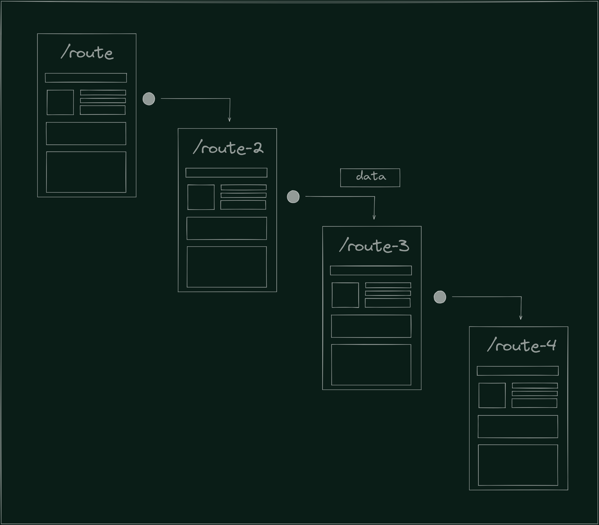
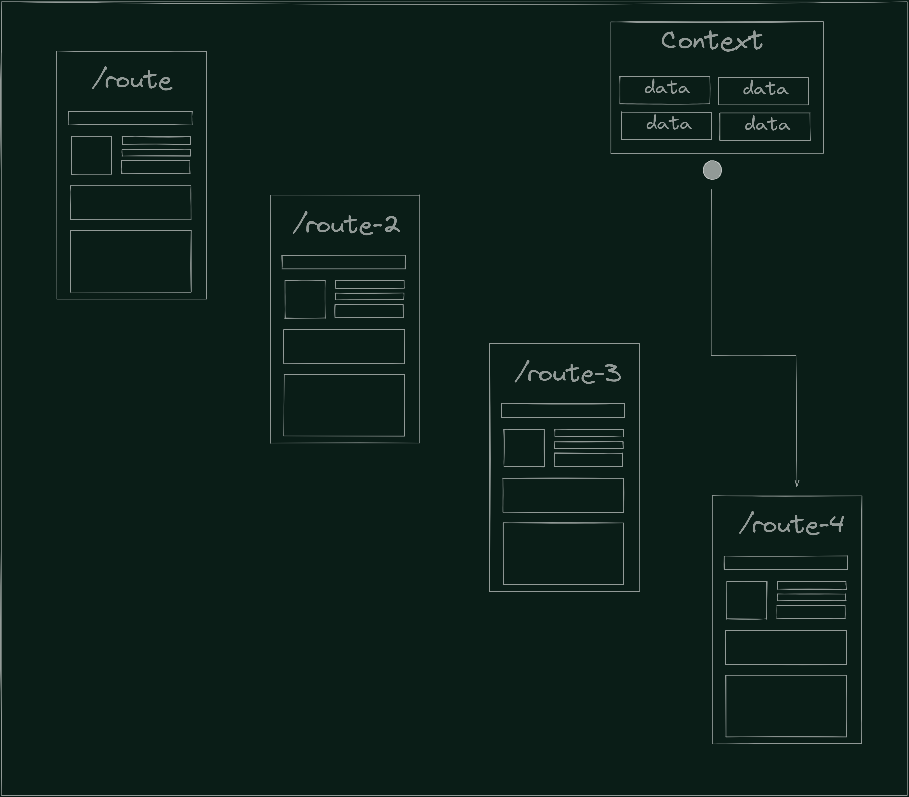
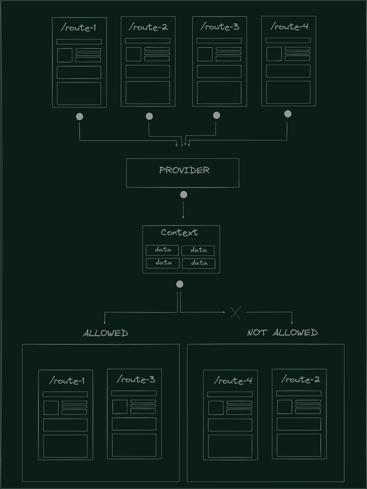
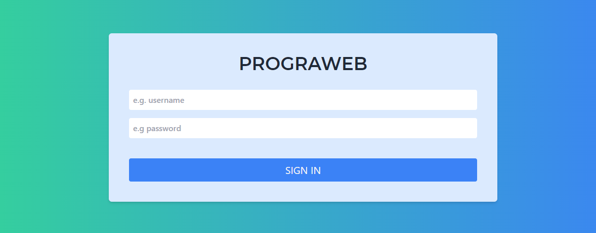
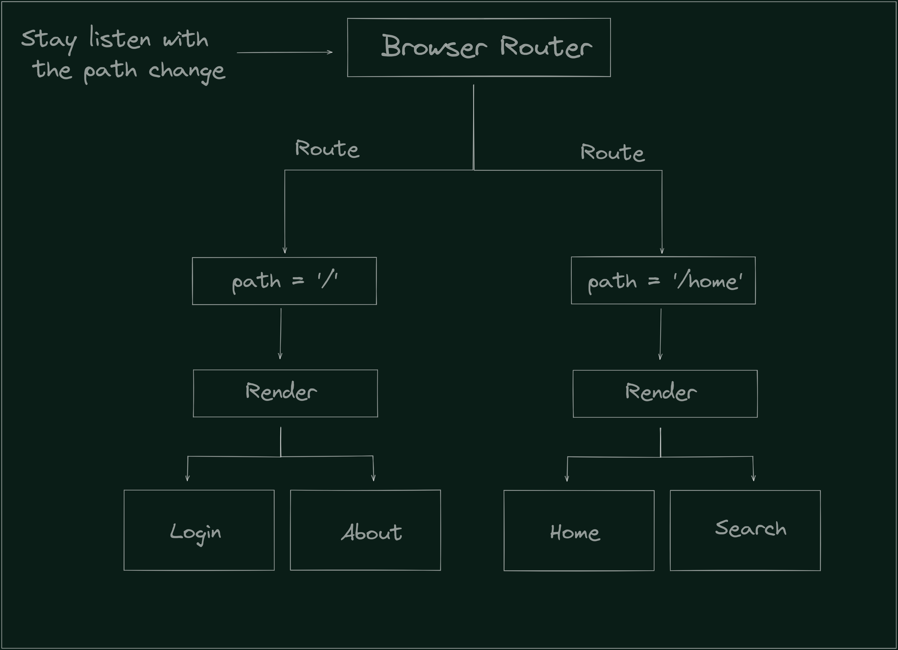
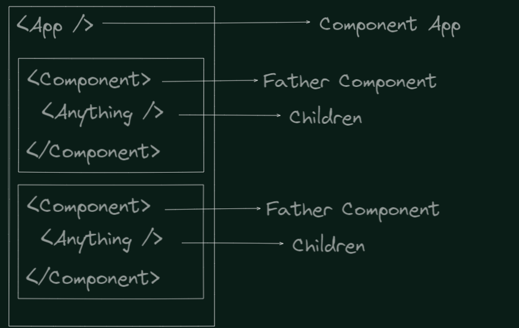

author: Henry Cortez, Fernando Batarsé, David Massana, Carolina Carranza
id: ProgramacionWeb-codelab-141121
summary: Laboratorio 04 estados globales y rutas
tags: workshop, iguide
categories: codelab,markdown
environments: Web
status: Published
analytics account: Google Analytics ID

# Autenticación

## ¡Bienvenidos/as!

Duration: 0:05:00

En este curso aprenderás como manejar rutas dinámicas y como comunicar esas rutas con un mismo archivo a traves de los contextos globales que nos provee **React**

### Lo que estaremos realizando

Nuestro objetivo es realizar un servicio de autenticación, es decir, un logueo que permita al usuario ver diferentes paginas dependiendo de su tipo de sesión.

- Comenzaremos creando cada un componente de login que nos ayudará posteriormente a renderizar otro componente o no dependiendo de la respuesta de nuestra API.

- Crearemos los servicios necesarios consumir una API.

- Se manejarán rutas dinámicas para redirigir a los usuarios a diferentes lugares de nuestra aplicación.

- Uso de contexto para comunicar un componente con variables especificas sin la necesidad de propiedad extras.


### ¿Qué aprenderás?

✅ Concepto de una **API**.

✅ Consumo de servicios de una **API**.

✅ Uso de **React hooks**.

✅ Estilos con tailwind.

✅ Contexto globales.

✅ Enrutamiento.

## Configuración del entorno

Duration: 0:10:00

### IDE

El editor de texto a trabajar será Visual Studio Code, si no tienes instalado dicho editor lo puedes descargar desde el siguiente [enlace](https://code.visualstudio.com/).

### Clonar el repositorio base

Asumimos que tienes instalado [git](https://git-scm.com/), clona el repositorio [base](https://github.com/Programacion-Web-0221-UCA/L04-REACTLOGIN) de la siguiente manera en tu lugar de preferencia:

```console
git clone https://github.com/Programacion-Web-0221-UCA/L04-REACTLOGIN.git
```

Después de clonar el repositorio accedemos a él mediante el comando:

```console
cd L04-REACTLOGIN
```

### Archivos

En el repositorio encontrarás la siguiente estructura propuesta.

```console
my-app
├── README.md
├── node_modules
├── package.json
├── .gitignore
├── tailwind.config.js
├── craco.config.js
├── public
├── ├── favicon.ico
├── ├── index.html
├── └── manifest.json
└── src
    ├── App.css
    ├── App.js
    ├── App.test.js
    ├── index.css
    ├── index.js
    ├── logo.svg
    ├── serviceWorker.js
    └── setupTests.js
```

Archivos a destacar sobre la estructura

**Assets** Carpeta donde se alojan todo tipo de recursos visuales como imágenes, gif, etc.

### Instalación de dependencias

Al ser un proyecto con **React**, es necesario instalar todas las dependencias necesarias para que nuestro programa compile. Para ello, realizar

```console
npm i
```

<aside class="negative">
 NOTA: npm i es una manera abreviada de npm install
</aside>

### Iniciar nuestra aplicación

Para iniciar nuestra aplicación ejecutaremos el siguiente comando en la terminal

```console
npm start
```

<aside class="negative">
 NOTA: npm start provee un hot reload, lo que implica que podemos ejecutar cambios en nuestra aplicación mientras se encuentra en ejecución y visualizar dichos cambios.
</aside>

## Contextos en React

Duration: 0:15:00

### Introducción

Como se ha mencionado, en muchas ocasiones es necesario comunicar a diferentes componentes entre sí, por ejemplo, una ruta que tenga como prerrequisito una respuesta de otro componente. Pero en muchas ocasiones no resulta demasiado eficiente pasar un atributo por muchos componentes ya que, si este se actualiza, se volverá a renderizar cada uno de los componentes por los cuales este ha viajado. Para ello, se brindan diferentes soluciones, ente una ellas, el uso de contextos.

### Objetivos

- Introducción a los contextos en React.



<aside class="negative">
NOTA: En <strong>React</strong> los datos se pasan de arriba hacia abajo (Padres a hijos)
</aside>

<aside class="negative">
NOTA: Un contexto puede ser visto como una variable global, la cual es accesible en cualquier parte de nuestra aplicación.
</aside>

### ¿Qué es un Contexto?

La forma mostrada en la imagen resulta muy incómoda e ineficiente para ciertos tipos de datos que son necesarios en muchos componentes dentro de nuestra aplicación. El contexto proporciona una forma de compartir un **dato** sin la necesidad que este sea pasado como una propiedad.



<aside class="negative">
NOTA: Al poseer un contexto, cualquier componente de nuestra aplicación puede acceder a el sin la necesidad de que este haya sido heredado (Se pase como props).
</aside>

<aside class="negative">
NOTA: <strong>React</strong> es capaz de manejar diferentes contextos en nuestra aplicación, lo cual indica que se puede tener diferentes estados globales.
</aside>

### Proveedores y consumidores

Los contextos suelen dividirse en proveedores y consumidores. Lo cuales nos ayudan a indicar quienes pueden consumir nuestro contexto y la forma de consumir dicho contexto.

#### Proveedores

Un proveedor puede ser visto como aquello que nos **provee** del objeto que desea ser compartido y es importante decirle quienes son capaces de utilizar nuestro objeto compartido

#### Consumidores

Los consumidores en un contexto, es la forma en la que nosotros obtenemos el objeto que fue proveído por nuestro **proveedor**



<aside class="negative">
NOTA: Este es un ejemplo ilustrativo de como funcionan los proveedores y consumidores, puede ser diferente.
</aside>

<aside class="negative">
NOTA: Con nuestro <strong>Provider</strong> estamos seguros de quienes pueden usar nuestro objeto y quienes no.
</aside>

### ¿Cuando usar el contexto?

Es importante mencionar que no se debe usar el contexto para cualquier variable solo porque esta desea ser pasada a un hijo como propiedad. Los contextos se deben ocupar únicamente en aquellos datos que puedan considerarse **globales**. Por ejemplo, el usuario actual, el tema de nuestra aplicación o incluso el idioma preferido. Si quieres profundizar mas en el tema, puedes visitar la documentación que provee **React** en el siguiente [enlace](https://es.reactjs.org/docs/context.html).

## Parte 1 - React Context

Duration: 0:10:00

### Utilizando Context

**Context** es una manera sencilla que provee React para poder tener acceso a algunos datos de manera **"global"**, sin importar el nivel del componente desde el cual deseemos acceder. Una de sus mayores ventajas es que evita que se pasen estos datos por `props` de varios componentes.

En nuestro caso haremos uso de Context para poder acceder al usuario que se está autenticado actualmente desde cualquier componente.

Dentro de `src` crearemos una carpeta llamada `contexts` y a su vez, dentro de ella estará un archivo con el nombre de `UserContext.js`.

Ahora comencemos creando nuestro objeto Context, que tendrá por nombre `UserContext`:

```
const UserContext = React.createContext();
```

Luego crearemos un componente `Provider`, que como su nombre lo indica, va a proveer a toda la aplicación de las variables, funciones o cualquier tipo de dato global que deseemos incluir.

```javascript
export const UserProvider = (props) => {
  const value = useMemo(
    () => ({
      // future logic
    }),
    []
  );

  return <UserContext.Provider value={value} {...props} />;
};
```

Este componente recibe `props` y retorna un componente `Provider` para el contexto que creamos anteriormente. Este a su vez cuenta con un prop llamado `value`, donde se incluirá todo lo que deseemos acceder en cualquier lugar de la aplicación.

En las secciones siguientes se conocerá cómo asignar estos valores, pero por el momento basta con saber que el método `useMemo` nos ayudará a almacenar valores en un objeto. Si nos fijamos, al igual que `useEffect`, cuenta con un segundo parámetro (dependencia), que indica cuándo se va a ejecutar.

Ya teniendo listo nuestro proveedor del contexto, es necesario hacer algunos cambios en el archivo `index.js`:

```javascript
ReactDOM.render(
  <React.StrictMode>
    <UserProvider>
      <App />
    </UserProvider>
  </React.StrictMode>,
  document.getElementById("root")
);
```

Lo que se hizo fue "rodear" el componente `App` con `UserProvider` para que, de esta manera podamos acceder a todos los recursos del contexto, tanto desde `App` como desde cualquier otro componente que se encuentre dentro.

✅ Con esto ya tenemos configurado nuestro Context.

## Parte 2 - Implementación del contexto

### Introducción

Ya una vez obtenido nuestro proveedor , es necesario crear el contexto para que nuestros componentes puedan hacer uso de el.

### Objetivos

- Uso del contexto.

- Uso del hook **useContext**

### Hooks: useContext

Como vimos anteriormente, creamos nuestro proveedor, el cual nos permite acceder a un valor desde cualquier parte de nuestra aplicación, pero un proveedor nos da la posibilidad de ocuparlo mas no nos brinda la manera de realizarlo. **useContext** es ese "consumidor" de todos nuestros contextos.

#### Funcionamiento

useContext es una función de **React** que recibe el contexto al cual queremos acceder. Si podemos acceder a dicho contexto, podremos obtener el valor alojado en dicho contexto, en caso contrario, obtendremos un valor nulo.

### Obteniendo el contexto de nuestra aplicación

En nuestro archivo **UserContext** crearemos una función **useUserContext** que se encargue de ayudarnos a obtener el valor guardado por nuestro **Provider**.

```javascript
export const useUserContext = () => {
  const context = React.useContext(UserContext);

  if (!context) {
    throw new Error("useUserContext() must be inside of UserProvider");
  }

  return context;
};
```

Explicando el código mostrado

**Paso 1**: Declaramos una función **useUserContext**.

**Paso 2**: Con la ayuda de **useContext** obtenemos el contexto de nuestro usuario, el cual está en UserContext.

**Paso 3**: Si no tenemos un valor en nuestro contexto, lanzamos un error, en caso contrario, retornamos nuestro contexto.

## Parte 2 - Creación de servicios

Duration: 0:15:00

### ¿Qué es un servicio?

Un servicio es un conjunto de protocolos que tienen el objetivo de hacer posible el intercambio de datos entre aplicaciones por medio de la administración de solicitudes. En este caso, necesitamos comunicarnos con la API llamada [POSTS](https://posts-pw2021.herokuapp.com/), de la cual podemos obtener todos los usuarios para permitir o no su atentificación, dependiendo de sus credenciales.

### Creación de archivo

Para comenzar, en nuestra carpeta principal `src`, crearemos una carpeta llamada `services` y dentro de ella agregaremos un nuevo archivo llamado `user.services.js`. Es ahí donde tendremos todo lo necesario para obtener la información de la API.

### Variables globales

Como hemos aprendido en el [Codelab anterior](https://hencor2019.github.io/nvm-guide/ProgramacionWeb-codelab-111021/index.html#4), es necesario contar con una URL base perteneciente a la API, ya que es indispensable para realizar las demás peticiones.

```javascript
const BASE_URL = "https://posts-pw2021.herokuapp.com/api/v1";
```

También declararemos un objeto vacío llamado `services`, donde se almacenarán las funciones que utilizaremos.

```javascript
const services = {};
```

### Inicio de sesión

Antes de realizar la función como tal, es necesario hacer un breve repaso sobre algunos métodos para realizar peticiones HTTP, estos son los que permiten la comunicación entre clientes y servidores.

| Método HTTP |                                       ¿Qué hace?                                        |
| :---------: | :-------------------------------------------------------------------------------------: |
|     GET     |                                 **Obtiene** un recurso                                  |
|    POST     |                   **Envía datos** para crear o actualizar un recurso                    |
|     PUT     | **Envía datos** para crear o actualizar un recurso y siempre produce el mismo resultado |
|   DELETE    |                           **Elimina** los datos especificados                           |
|    PATCH    |                          **Modifica parcialmente** un recurso                           |

Si quieres saber más sobre estos u otros métodos, puedes visitar el siguiente [enlace](https://www.w3schools.com/tags/ref_httpmethods.asp).

Teniendo claros estos métodos, procederemos a asignar la función `login` como un atributo de nuestro objeto `services`:

```javascript
services.login = async (username, password) => {
  const response = await fetch(`${BASE_URL}/auth/signin`, {
    method: "POST",
    headers: {
      "Content-type": "application/json",
    },
    body: JSON.stringify({
      username: username,
      password: password,
    }),
  });

  if (response.ok) {
    const data = await response.json();
    return data;
  }

  return {};
};
```

Como podemos notar se trata de una función `async` y cuenta con un `fetch` a la URL que corresponde al inicio de sesión (esto se encuentra en la documentación de [POSTS API](https://posts-pw2021.herokuapp.com/)), en la sección **"Auth"**.

#### Init object

Dentro de `fetch` también se ha colocado un objeto como segundo parámetro que permite controlar algunas configuraciones a aplicarle a la petición, tales como:

- `method` - En este caso se trata de un método POST porque vamos a enviar el nombre de usuario y la contraseña ingresadas.
- `headers` - Son utilizados para enviar información adicional sobre los datos. Puedes profundizar en este [enlace](https://developer.mozilla.org/es/docs/Web/HTTP/Headers)
- `body` - El cuerpo de la petición que contiene los datos enviados.

<aside class="positive">
El método JSON.stringify() convierte un objeto de JavaScript en una cadena de texto en formato JSON.
</aside>

Finalmente, comprobamos si la respuesta obtenida es correcta mediante la validación `if (response.ok)` y retornamos los datos esperados si todo sale bien, o un objeto vacío en caso contrario.

### Validación de token

Un **token** es una cadena de caracteres utilizada para identificar a un usuario, aplicación, página, entre otros. En este caso los utilizaremos para poder saber qué usuario intenta iniciar sesión.

En el mismo archivo `user.services.js` crearemos otra función como atributo de `services`, de la siguiente manera:

```javascript
services.verifyToken = async (token) => {
  const response = await fetch(`${BASE_URL}/auth/whoami`, {
    method: "GET",
    headers: {
      Authorization: `Bearer ${token}`,
    },
  });

  if (response.ok) {
    const data = await response.json();
    return data;
  }

  return {};
};
```

Como podemos notar, esta función es muy parecida a la anterior. Las únicas diferencias más notorias son que su `method` ahora es GET, es decir, que queremos obtener los datos del usuario con ese token y ahora tenemos otro tipo de `headers`.

Como paso final, no olvides exportar el objeto `services`:

```javascript
export default services;
```

✅ Ya tenemos nuestros servicios que se encargarán de la comunicación con la API.

## Parte 4 - Funciones de un usuario

Como se ha mencionado, nuestro **Provider** nos brinda un objeto pero en muchas ocasiones queremos que nuestro contexto cambie, ya sea porque se actualizo un dato y es necesario informar o porque internamente paso algo y el contexto debe cambiar, por ello, podemos agregar métodos y variables que nos ayuden a realizar esas acciones.

<aside class="negative">
NOTA: Es recomendable hacer los metodos que modifican en el provider en el mismo Provider. En nuestro caso, en <strong>UserProvider</strong>
</aside>

<aside class="negative">
NOTA: Un <strong>Provider</strong> puede ser visto también como un bául, el cual cuenta con todo lo necesario para trabajar sobre el sin la necesidad de crear archivos externos.
</aside>

### Manejo de tokens

Una forma segura de consumir una API es mediante **tokens**, los cuales nos ayudan a autenticar un usuario para posteriores peticiones. La API a utilizar nos brinda de un token para los inicios de sesión, por lo cual es necesario guardar dicho token. Para ello haremos uso de funciones que se encarguen de actualizar nuestros tokens de acceso.

Declaramos un estado para nuestro token en nuestro **UserProvider**, el cual se encargará de brindarnos el token y actualizar en dado caso sea necesario.

```javascript
const [token, setToken] = useState(undefined);
```

#### Traer el token actual

Declaramos el metodo **getToken**, el cual nos ayudará a traer nuestro token de nuestro localStorage.

```javascript
const getToken = () => localStorage.getItem(TOKEN_KEY);
```

#### Actualizar nuestro token

Para actualizar nuestro token haremos uso de una función llamada **setTokenAll**. Escribimos lo siguiente en nuestro **UserProvider**

```javascript
const setTokenAll = (token) => {
  localStorage.setItem(TOKEN_KEY, token);
  setToken(token);
};
```

<aside class="negative">
NOTA: TOKEN_KEY es el nombre con el cual guardamos nuestro token
</aside>

<aside class="negative">
NOTA: En nuestro caso usamos el localStorage, pero también se puede hacer uso de cookies y sessionStorage
</aside>

#### Verificar la validez de nuestro token

Al tener un token es necesario validarlo. Crearemos un efecto (useEffect) ya que necesitaremos verificar un usuario cada vez que este se intente loguear y con la ayuda de los servicios creados, crearemos internamente una función llamada **verifyTokenAsync**

```javascript
useEffect(() => {
  const verifyTokenAsync = async () => {
    const lsToken = getToken();

    if (lsToken) {
      const { username, role } = await userService.verifyToken(lsToken);
      if (username && role) {
        setUser({ username, role });
        setTokenAll(lsToken);
      }
    }
  };

  verifyTokenAsync();
}, [token]);
```

Explicando el código mostrado

**Paso 1**: Declaramos nuestro efecto y una función para verificar nuestro token.

**Paso 2**: Con el método **getToken** obtenemos el token actual de nuestro localStorage. Si no poseemos un token, no es necesario hacer ninguna acción.

**Paso 3**: Si tenemos un token verificamos su validez ya que puede ser un token no valido o un token vencido, para lo cual hacemos uso del servicio **verifyToken** de nuestros **userService**. Del cual podremos obtener el usuario y el rol del usuario en nuestra aplicación.

**Paso 4**: Si obtenemos un **username** y un **rol**, es necesario actualizar el estado del usuario previamente definido.

<aside class="negative">
NOTA: Queremos que nuestro efecto se ejecute cada vez que nuestro token cambie, por eso mismo nuestro token será una dependencia de nuestro useEffect.
</aside>

### Función de login

Crearemos una función de logueo que nos ayude a consumir el servicio creado anteriormente para ingresar con un usuario, para ello, declararemos una función llamada login que se encargará de dicho proceso.

```javascript
const login = useCallback((username, password) => {
  const loginAsync = async () => {
    let status = false;
    try {
      const { token: tokenRes } = await userService.login(username, password);

      if (tokenRes) {
        setTokenAll(tokenRes);
        status = true;
      }
    } catch (error) {
      console.error(error);
      console.error("Error in login");
    } finally {
      return status;
    }
  };

  return loginAsync();
}, []);
```

Explicando el código mostrado anteriormente

**Paso 1**: Hacemos uso de useCallback para declarar una función controlada que reciba un **username** y una **password**.

**Paso 2**: Declaramos una función asincrona que nos indique el status de nuestro servicio de logueo.

**Paso 3**: Hacemos uso de el método **login** de nuestros **userService** y le indicamos los métodos necesarios. Si nuestras credenciales son correctas, se nos devolverá el token.

<aside class="negative">
NOTA: useCallback nos ayuda a crear una función que se renderice cuando nosotros le indiquemos. Puedes leer más en <a href="https://reactjs.org/docs/hooks-reference.html">useCallback</a>
</aside>

### Funcion de logout

Si el usuario desea salirse de nuestra aplicación, es necesario limpiar nuestro estado global. Declaramos una función llamada logout que se encargue de limpiar tanto nuestro estado de user como nuestro estado de token.

```javascript
const logout = useCallback(() => {
  setUser(undefined);
  setTokenAll(undefined);
}, []);
```

<aside class="negative">
NOTA: al validar los valores undefined con las funciones, es valido colocar dichos datos para "limpiar" nuestro contexto.
</aside>

### Resultado final de nuestro contexto

Si se han realizado todos los métodos y cambios sobre nuestro archivo **UserContext**, debemos tener el siguiente resultado.

```javascript
import React, { useState, useEffect, useMemo, useCallback } from "react";

import userService from "./../services/user.services";

const UserContext = React.createContext();
const TOKEN_KEY = "token";

export const UserProvider = (props) => {
  const [token, setToken] = useState(undefined);
  const [user, setUser] = useState(undefined);

  useEffect(() => {
    const verifyTokenAsync = async () => {
      const lsToken = getToken();

      if (lsToken) {
        const { username, role } = await userService.verifyToken(lsToken);
        if (username && role) {
          setUser({ username, role });
          setTokenAll(lsToken);
        }
      }
    };

    verifyTokenAsync();
  }, [token]);

  const setTokenAll = (token) => {
    localStorage.setItem(TOKEN_KEY, token);
    setToken(token);
  };

  const login = useCallback((username, password) => {
    const loginAsync = async () => {
      let status = false;
      try {
        const { token: tokenRes } = await userService.login(username, password);

        if (tokenRes) {
          setTokenAll(tokenRes);
          status = true;
        }
      } catch (error) {
        console.error(error);
        console.error("Error in login");
      } finally {
        return status;
      }
    };

    return loginAsync();
  }, []);

  const logout = useCallback(() => {
    setUser(undefined);
    setTokenAll(undefined);
  }, []);

  const value = useMemo(
    () => ({
      token: token,
      user: user,
      login: login,
      logout: logout,
    }),
    [token, user, login, logout]
  );

  return <UserContext.Provider value={value} {...props} />;
};

export const useUserContext = () => {
  const context = React.useContext(UserContext);

  if (!context) {
    throw new Error("useUserContext() must be inside of UserProvider");
  }

  return context;
};

const getToken = () => localStorage.getItem(TOKEN_KEY);
```

## Parte 5 - Login

### Introducción

Con la finalidad de entender a profundidad como funcionan los servicios y hooks utilizados anteriormente se realizará una página para poder autentificarse.

En esta se otorgará el permiso para accesar a diversas páginas como usuario normal o como administrador, ingresando el usuario y la contraseña.

### Objetivos

- Establecer una página para poder iniciar sesión

### Login.jsx

Está página nos permitira iniciar sesión.



Al principio es necesario crear una carpeta en la carpeta "src" a la cual llamaremos "pages" y en esta crearemos una carpeta "Login" y por último en esta carpeta se creará un archivo llamado Login.jsx.

Posteriormente en este archivo se creará un componente llamado "Login" y se exportará.

```javascript
const Login = () => {};

export default Login;
```

En este componente nosotros retornaremos el siguiente html:

```javascript
return (
  <div className="flex justify-center items-center min-h-screen bg-gradient-to-r from-green-400 to-blue-500">
    <main className="w-3/4 max-w-3xl bg-blue-100 rounded-md p-8 md:p-10 shadow-md">
      <form className="flex flex-col gap-4 items-center justify-center">
        <h2 className="uppercase text-gray-800 font-monserrat font-black text-4xl mb-4">
          Prograweb
        </h2>
        <input
          className="font-medium w-full text-gray-700 focus:outline-none focus:ring focus:border-gray-700 p-2 rounded"
          type="text"
          placeholder="e.g. username"
        />
        <input
          className="font-medium w-full text-gray-700 focus:outline-none focus:ring focus:border-gray-700 p-2 rounded"
          type="password"
          placeholder="e.g password"
        />
        <button className="mt-6 w-full transition rounded border border-blue-500 duration-300 ease-in-out text-xl text-extrabold uppercase bg-blue-500 hover:bg-blue-700 py-2 px-4 text-gray-100">
          Sign In{" "}
        </button>
      </form>
    </main>
  </div>
);
```

<aside class="positive">
    NOTA: Recordando que todas las clases vienen de la documentación de <a href="https://tailwindcss.com/docs" target="_blank">Tailwind CSS</a>.
</aside>

Posteriormente es necesario importar useState

```javascript
import { useState } from "react";
```

Lo anterior con el objetivo de declarar estados para el nombre de usuario, la contraseña y el posible mensaje de error.

```javascript
const [username, setUsername] = useState("");
const [password, setPassword] = useState("");
const [error, setError] = useState(false);
```

Cambiando los estados con la siguiente función:

```javascript
const onChange = (e, save) => {
  save(e.target.value);
};
```

Utilizando la función en el onChange y el estado en el value de los inputs

```javascript
<input className="font-medium w-full text-gray-700 focus:outline-none focus:ring focus:border-gray-700 p-2 rounded"
  type='text'
  value={username}
  placeholder='e.g. username'
  onChange={(e) => onChange(e, setUsername)}
/>

<input className="font-medium w-full text-gray-700 focus:outline-none focus:ring focus:border-gray-700 p-2 rounded"
  type="password"
  placeholder="e.g password"
  onChange={(e) => onChange(e, setPassword)}
  value={password}
/>
```

Pero antes de crear la función de "onSubmitHandler" es necesario tener la función para iniciar sesión y el token del usuario para lo cual es necesario importar el "useContext" que se creó anteriormente.

```javascript
import { useUserContext } from "../../contexts/UserContext";
```

Y obtener la función y el token.

```javascript
const { login, token } = useUserContext();
```

Obteniendo esto ya podemos crear la función "onSubmitHandler" de la siguiente manera:

```javascript
const onSubmitHandler = async (e) => {
  e.preventDefault();

  const logged = await login(username, password);

  setError(!logged);
  setUsername("");
  setPassword("");
};
```

En la cual "seteamos" el valor el error si es que lo hay y limpiando el valor del usuario y de la contraseña

mandandola a llamar en el form con el atributo onSubmit

```javascript
onSubmit = { onSubmitHandler };
```

incluyendo lo siguiente en el html si existe un error:

```javascript
{
  error && (
    <p className="w-full rounded p-3 text-center text-white font-roboto bg-red-700 select-none">
      Un error ha ocurrido en el inicio de sesión
    </p>
  );
}
```

Y por último ya que se actualizo el token realizar un "if" para imprimir en consola que si se pudo "loggear".

```javascript
if (token) {
  console.log("Ya se loggea");
}
```

Quedando todo de la siguiente manera:

```javascript
import { useState } from "react";
import { useUserContext } from "../../contexts/UserContext";

export default function Login() {
  const { login, token } = useUserContext();

  const [username, setUsername] = useState("");
  const [password, setPassword] = useState("");

  const [error, setError] = useState(false);

  const onChange = (e, save) => {
    save(e.target.value);
  };

  const onSubmitHandler = async (e) => {
    e.preventDefault();

    const logged = await login(username, password);

    setError(!logged);
    setUsername("");
    setPassword("");
  };

  if (token) {
    console.log("Ya se loggea");
  }

  return (
    <div className="flex justify-center items-center min-h-screen bg-gradient-to-r from-green-400 to-blue-500">
      <main className="w-3/4 max-w-3xl bg-blue-100 rounded-md p-8 md:p-10 shadow-md">
        <form
          onSubmit={onSubmitHandler}
          className="flex flex-col gap-4 items-center justify-center"
        >
          <h2 className="uppercase text-gray-800 font-monserrat font-black text-4xl mb-4">
            Prograweb
          </h2>

          {error && (
            <p className="w-full rounded p-3 text-center text-white font-roboto bg-red-700 select-none">
              Un error ha ocurrido en el inicio de sesión
            </p>
          )}

          <input
            className="font-medium w-full text-gray-700 focus:outline-none focus:ring focus:border-gray-700 p-2 rounded"
            type="text"
            value={username}
            placeholder="e.g. username"
            onChange={(e) => onChange(e, setUsername)}
          />

          <input
            className="font-medium w-full text-gray-700 focus:outline-none focus:ring focus:border-gray-700 p-2 rounded"
            type="password"
            placeholder="e.g password"
            onChange={(e) => onChange(e, setPassword)}
            value={password}
          />

          <button className="mt-6 w-full transition rounded border border-blue-500 duration-300 ease-in-out text-xl text-extrabold uppercase bg-blue-500 hover:bg-blue-700 py-2 px-4 text-gray-100">
            Sign In{" "}
          </button>
        </form>
      </main>
    </div>
  );
}
```

## Rutas dinámicas

Duration: 0:05:00

### Introducción

Como sabemos, React se conoce por ser una [SPA](https://developer.mozilla.org/en-US/docs/Glossary/SPA), lo cual nos niega el uso de más de un archivo HTML. A continuación, se presenta una forma que solucione dicho problema de las rutas dinámicas.

### Objetivos

- Conocer el uso de enrutadores.

- Entender como funciona un enrutamiento.

### React Router Dom

React router dom es una forma de crear rutas dinámicas de una manera sencilla y controlada (Ya que nosotros indicamos que rutas existen en nuestra aplicación).

<aside class="positive">
NOTA: React Router Dom nos ayuda a cambiar entre componentes, mas no nos crea archivos HTML extras. Siempre trabajaremos sobre un mismo <strong>index.html</strong>
</aside>

#### Funcionamiento

El funcionamiento del enrutamiento, por lo general es el mismo. Primero necesitamos a alguien que sea nuestro "vigilante", el cual tiene la función de avisar que nuestra ruta ha cambia. Luego tendremos nuestro Router, el cual se encargará de cambiar dichas rutas por las indicadas. Un resumen de lo que se ha mencionado puede ser:

| Enrutamiento  |                    ¿Qué hace?                    |
| :-----------: | :----------------------------------------------: |
| BrowserRouter |      **Escucha** los cambios de nuestra url      |
|    Router     |          **Cambia** A la ruta indicada           |
|     path      | **Ayuda** Al Router a renderizar los componentes |



<aside class="positive">
NOTA: <strong>Login, About, Home y Search</strong> son los componentes que se renderizarán dependiendo nuestro path.
</aside>

<aside class="positive">
NOTA: <strong>BrowserRouter</strong> escucha los cambios del history, el cual esta incluido en nuestro navegador.
</aside>

#### Sintaxis

A continuación se muestra el uso del enrutamiento con [React Router DOM](https://reactrouter.com/docs/en/v6)

```javascript
<BrowserRouter>
  <Routes>
    <Route path="/" element={<App />} />
    <Route path="expenses" element={<Expenses />} />
    <Route path="invoices" element={<Invoices />} />
  </Routes>
</BrowserRouter>
```

Se explica el código mostrado

**Paso 1**: Con la ayuda de nuestro **BrowserRouter** declaramamos nuestro "listener" para el cambio de rutas.

**Paso 2**: Al poseer varias rutas, es necesario un "switch" que nos ayude a realizar el cambio de las rutas, eso se encargará nuestro **Routes**.

**Paso 3**: Declaramos la ruta con **Route** y en ella indicamos el path y el componente que renderizará dicho path.

<aside class="positive">
NOTA: React Router DOM puede ser capaz de renderizar varios elementos, pero estos deben ser envueltos en un solo componente para respetar la renderización por JSX (únicamente un elemento).
</aside>

Un ejemplo completo de React Router DOM se puede visualizar de la siguiente manera

```javascript
import { render } from "react-dom";
import { BrowserRouter, Routes, Route } from "react-router-dom";
import App from "./App";
import Expenses from "./routes/expenses";
import Invoices from "./routes/invoices";

const rootElement = document.getElementById("root");
render(
  <BrowserRouter>
    <Routes>
      <Route path="/" element={<App />} />
      <Route path="expenses" element={<Expenses />} />
      <Route path="invoices" element={<Invoices />} />
    </Routes>
  </BrowserRouter>,
  rootElement
);
```

<aside class="positive">
NOTA: Puedes leer más en el siguiente <a href="https://reactrouter.com/docs/en/v6/getting-started/tutorial">enlace</a>
</aside>

## Parte 6 - Creación de componentes para las rutas

### Introducción

Ahora que ya sabemos como funciona el enrutamiento, es necesario definir todas las rutas para que nuestro router funciones

### Objetivos

- Creación de componentes.

- Rutas privadas y públicas

### Rutas públicas

Una ruta pública es como su nombre lo indica, es una ruta que puede acceder cualquier persona independientemente de su rol en la aplicación. En nuestro caso vamos a crear una ruta para un usuario con un rol de **user** (Esto basado en nuestra API de [POSTS](https://posts-pw2021.herokuapp.com/))

#### Ruta publica - User

Crearemos un componente **User** que nos ayudará a mostrar un contenido público para un usuario con un rol **USER**. Para ello crearemos el siguiente componente. Crearemos en nuestra carpeta **pages** un directorio User con su respectivo archivo User.jsx. Quedando de la siguiente manera.

```console
src
├── pages
├── ├── Login
├── ├── ├── Login.jsx
├── ├── User
├── ├── ├── User.jsx
├── App.css
├── App.js
├── App.test.js
├── index.css
├── index.js
├── logo.svg
├── serviceWorker.js
└── setupTests.js
```

```javascript
return (
  <section className="flex gap-4 flex-col lg:flex-row justify-around items-center p-6 lg:p-10 min-h-screen">
    <div className="w-4/5 lg:w-1/2 gap-6 h-full flex flex-col justify-around items-center">
      <h2 className="text-5xl lg:text-6xl font-extrabold text-gray-800 text-center">
        User page
      </h2>
      <h3 className="text-lg font-medium text-gray-700 text-center">
        An admin role is not required to access this page
      </h3>

      <p className="text-xl font-medium text-gray-400 text-center mt-6">
        All users can visit this page if their credentials are valid
      </p>

      <button
        onClick={logoutHandler}
        className="mt-6 w-1/2 lg:w-1/3 transition rounded border border-blue-500 duration-300 ease-in-out text-lg text-extrabold uppercase bg-blue-500 hover:bg-blue-700 py-2 px-4 text-gray-100"
      >
        Log out
      </button>
    </div>

    <div className="w-4/5 lg:w-1/2 flex justify-center items-center">
      
    </div>
  </section>
);
```

Explicando el código mostrado:

**Paso 1**: Declaramos nuestro estructura HTML con los diferentes estilos utilizando [tailwind](https://tailwindcss.com/docs/guides/create-react-app).

Ahora que ya tenemos nuestra estructura HTML, nos dispondremos a realizar todas las validaciones necesarias para una ruta, para las cuales necesitamos

✅ A nuestra ruta solo pueden acceder si se encuentran logueados.

✅ Si poseen un rol específico (En nuestro caso, que nuestro rol sea **user**).

Antes de realizar dichas validaciones es necesario definir unos conceptos referentes a React Router DOM.

#### Navegación en React Router DOM

Si se quiere redireccionar desde un componente a otro componente es necesario que sea indicado. Para ello React Router DOM nos proporciona sus propios hooks (custom hooks).

El primer hook es llamado **useNavigate**. El cual nos proporciona una función a la que le podemos indicar hacia que ruta deseamos ir.

El segundo hook es llamado **Navigate**. El cual obliga al componente a renderizar otro componente.

<aside class="positive">
IMPORTANTE: Navigate como tal no es un hook ya que este no necesita instancias. Navigate se puede visualizar como un componente que renderiza otro componente. Esto es importante si se desea redirigir sin una verificación previa.
</aside>

<aside class="positive">
IMPORTANTE: La diferencia entre useNavigate y Navigate es que useNavigate necesita ser llamado (invocado) ya que es una funcion, en cambio Redirect se puede visualizar como un componente.
</aside>

<aside class="positive">
NOTA: Un custom hook se puede visualizar como una caja negra. La cual nos proporciona metodos y funcionalidades pero no indica como se realizan.
</aside>

```javascript
const navigate = useNavigate();
const { logout } = useUserContext();

const logoutHandler = () => {
  logout();
  navigate("/login");
};
```

Explicando el bloque de código mostrado

**Paso 1**: Hacemos uso del hook useNavigate para redirecciones y creamos una instancia de este.

**Paso 2**: Creamos el método **logoutHandler** que hará uso del metodo logout creado anteriormente en nuestro contexto para limpiar nuestro localStorage y nuestro estado global.

**Paso 3**: Al crear una instancia de useNavigate , hacemos uso de ella indicandole la ruta a la que debe ir, en nuestro caso a **login**.

Si se ha seguido correctamente, se deberá tener en nuestro componente **User** la siguiente estructura.

```javascript
import { useUserContext } from "../../contexts/UserContext";
import { useNavigate } from "react-router-dom";
import user from "../../assets/img/user.png";

export default function User() {
  const navigate = useNavigate();
  const { logout } = useUserContext();

  const logoutHandler = () => {
    logout();
    navigate("/login");
  };

  return (
    <section className="flex gap-4 flex-col lg:flex-row justify-around items-center p-6 lg:p-10 min-h-screen">
      <div className="w-4/5 lg:w-1/2 gap-6 h-full flex flex-col justify-around items-center">
        <h2 className="text-5xl lg:text-6xl font-extrabold text-gray-800 text-center">
          User page
        </h2>
        <h3 className="text-lg font-medium text-gray-700 text-center">
          An admin role is not required to access this page
        </h3>

        <p className="text-xl font-medium text-gray-400 text-center mt-6">
          All users can visit this page if their credentials are valid
        </p>

        <button
          onClick={logoutHandler}
          className="mt-6 w-1/2 lg:w-1/3 transition rounded border border-blue-500 duration-300 ease-in-out text-lg text-extrabold uppercase bg-blue-500 hover:bg-blue-700 py-2 px-4 text-gray-100"
        >
          Log out
        </button>
      </div>

      <div className="w-4/5 lg:w-1/2 flex justify-center items-center">
        
      </div>
    </section>
  );
}
```

### Rutas privadas

Una ruta privada como su nombre lo indica es una ruta que necesita de condiciones específicas para que se pueda acceder a ella.

#### Ruta privada - Admin

Crearemos un componente **Admin** que muestre información general pero que solo se puedan acceder a ella las personas que posean un rol de administrador. Para ello crearemos en nuestra carpeta **pages** el directorio Admin con su respectivo archivo, quedando de la siguiente manera

```console
src
├── pages
├── ├── Login
├── ├── ├── Login.jsx
├── ├── Admin
├── ├── ├── Admin.jsx
├── ├── User
├── ├── ├── User.jsx
├── App.css
├── App.js
├── App.test.js
├── index.css
├── index.js
├── logo.svg
├── serviceWorker.js
└── setupTests.js
```

```javascript
return (
  <section className="flex gap-4 flex-col lg:flex-row justify-around items-center p-6 lg:p-10 min-h-screen">
    <div className="w-4/5 lg:w-1/2 gap-6 h-full flex flex-col justify-around items-center">
      <h2 className="text-5xl lg:text-6xl font-extrabold text-gray-800 text-center">
        Admin page
      </h2>
      <h3 className="text-lg font-medium text-gray-700 text-center">
        Only users with the admin role can view this page
      </h3>

      <p className="text-xl font-medium text-gray-400 text-center mt-6">
        If you want to see this page you have to ask permission from the
        administrators of the application
      </p>

      <button
        onClick={logoutHandler}
        className="mt-6 w-1/2 lg:w-1/3 transition rounded border border-blue-500 duration-300 ease-in-out text-lg text-extrabold uppercase bg-blue-500 hover:bg-blue-700 py-2 px-4 text-gray-100"
      >
        Log out
      </button>
    </div>

    <div className="w-4/5 lg:w-1/2 flex justify-center items-center">
      
    </div>
  </section>
);
```

<aside class="positive">
NOTA: El componente User y Admin tienen una misma estructura. solo cambia su contenido. Esto es con el fin de simular dicho enrutamiento.
</aside>

Al igual que el componente **User** se creará los métodos utilizando **useNavigate** quedando de la siguiente manera

```javascript
const navigate = useNavigate();
const { logout } = useUserContext();

const logoutHandler = () => {
  logout();
  navigate("/login");
};
```

Ahora como resultado final tendremos un componente Admin con el siguiente contenido

```javascript
import { useUserContext } from "../../contexts/UserContext";
import { useNavigate } from "react-router-dom";
import ADMIN from "../../assets/img/admin-img.png";

export default function Admin() {
  const navigate = useNavigate();
  const { logout } = useUserContext();

  const logoutHandler = () => {
    logout();
    navigate("/login");
  };

  return (
    <section className="flex gap-4 flex-col lg:flex-row justify-around items-center p-6 lg:p-10 min-h-screen">
      <div className="w-4/5 lg:w-1/2 gap-6 h-full flex flex-col justify-around items-center">
        <h2 className="text-5xl lg:text-6xl font-extrabold text-gray-800 text-center">
          Admin page
        </h2>
        <h3 className="text-lg font-medium text-gray-700 text-center">
          Only users with the admin role can view this page
        </h3>

        <p className="text-xl font-medium text-gray-400 text-center mt-6">
          If you want to see this page you have to ask permission from the
          administrators of the application
        </p>

        <button
          onClick={logoutHandler}
          className="mt-6 w-1/2 lg:w-1/3 transition rounded border border-blue-500 duration-300 ease-in-out text-lg text-extrabold uppercase bg-blue-500 hover:bg-blue-700 py-2 px-4 text-gray-100"
        >
          Log out
        </button>
      </div>

      <div className="w-4/5 lg:w-1/2 flex justify-center items-center">
        
      </div>
    </section>
  );
}
```

### Rutas desconocidas.

A menudo ocurre que un usuario escribe una ruta que no esta siendo controlada, por ejemplo, si se escribe "jldjadljal" , nuestro enrutamiendo no estará controlando dicha ruta. Por ese motivo es necesario crear un componente que se renderice en dichos casos.

#### Ruta desconocida - 404

Crearemos un componente llamada **NotFound** que se mostrará cuando nuestro ususario escriba una ruta que no existe. Crearemos dicho componente en nuestra carpeta **pages** quedando de la siguiente manera.

```console
src
├── pages
├── ├── Login
├── ├── ├── Login.jsx
├── ├── Admin
├── ├── ├── Admin.jsx
├── ├── User
├── ├── ├── User.jsx
├── ├── NotFound
├── ├── ├── NotFound.jsx
├── App.css
├── App.js
├── App.test.js
├── index.css
├── index.js
├── logo.svg
├── serviceWorker.js
└── setupTests.js
```

```javascript
return (
  <div className="flex flex-col justify-center items-center w-screen h-screen bg-gray-200">
    <ImSad className="text-8xl m-4" />
    <h2 className="text-6xl font-roboto text-center mb-6">404</h2>
    <h3 className="text-xl font-roboto text-center">Page not found</h3>
    <p className="text-lg font-roboto text-center">
      The page you are looking for doesnt exist or an other error occurred
    </p>
    <button className="font-roboto bg-gray-300 m-4 py-2 px-4 rounded">
      Go to Login
    </button>
  </div>
);
```

Explicando el bloque de código.

**Paso 1**: Se crea una estructura HTML sencilla para mostrar que no encontramos dicha página en nuestro enrutador.

Es importante redireccionar al usuario a una página que exista, para ello declararemos un evento **onClick** que nos ayude a realizar dicha acción.

```javascript
const navigate = useNavigate();

const onClick = (e) => {
  navigate("/login");
};
```

Explicando el bloque de código.

**Paso 1**: De igual manera que con nuestras rutas públicas y privadas, declaramos nuestro **useNavigate** y creamos una instancia de el.

**Paso 2**: Creamos un método onClick que se encargue de navegar hacia una ruta específica, en nuestro caso **login**.

Actualizando nuestro componente, quedaría de la siguiente manera.

```javascript
import { ImSad } from "react-icons/all";
import { useNavigate } from "react-router-dom";

const NotFound = () => {
  const navigate = useNavigate();

  const onClick = (e) => {
    navigate("/login");
  };

  return (
    <div className="flex flex-col justify-center items-center w-screen h-screen bg-gray-200">
      <ImSad className="text-8xl m-4" />
      <h2 className="text-6xl font-roboto text-center mb-6">404</h2>
      <h3 className="text-xl font-roboto text-center">Page not found</h3>
      <p className="text-lg font-roboto text-center">
        The page you are looking for doesnt exist or an other error occurred
      </p>
      <button
        className="font-roboto bg-gray-300 m-4 py-2 px-4 rounded"
        onClick={(e) => onClick(e)}
      >
        Go to Login
      </button>
    </div>
  );
};

export default NotFound;
```

Ahora que tenemos todas nuestras rutas, podemos comenzar a trabajar sobre ellas.

## Parte 7 - Protegiendo una ruta

### Introducción

Como algunos de nuestros componentes necesitamos que sean privados, es necesario hacer las verificaciones necesarias, para ellos crearemos nuestro componente que verifique dichas reglas.

### Objetivos

- Protección de rutas.

- Redireccionamiento dinámico.

### Redireccionar al usuario - RedirectUser

Crearemos nuestro directorio Redirect adentro de pages con su respectivo archivo RedirectUser.jsx, quedando de la siguiente manera

```console
src
├── pages
├── ├── Login
├── ├── ├── Login.jsx
├── ├── Admin
├── ├── ├── Admin.jsx
├── ├── User
├── ├── ├── User.jsx
├── ├── NotFound
├── ├── ├── NotFound.jsx
├── ├── Redirect
├── ├── ├── RedirectUser.jsx
├── App.css
├── App.js
├── App.test.js
├── index.css
├── index.js
├── logo.svg
├── serviceWorker.js
└── setupTests.js
```

```javascript
import { useUserContext } from "../../contexts/UserContext";
import { Navigate } from "react-router-dom";

const rolePages = {
  admin: "/admin",
  user: "/user",
};

const RedirectUser = () => {
  const { user } = useUserContext();

  if (!user) return <p> No se puede redireccionar </p>;

  return <Navigate replace to={rolePages[user.role] ?? "/"} />;
};

export default RedirectUser;
```

Explicando el bloque de código mostrado

**Paso 1**: Importamos nuestro contexto y Navigate

**Paso 2**: Definimos todos los roles que existen en nuestra aplicación con ayuda de un objeto.

**Paso 3**: Como useUserContext nos brinda el usuario actual con su respectivo role, verificamos que se tenga un usuario. Si no se tiene un usuario, mostramos un mensaje que no se puede redireccionar.

**Paso 4**: Caso contrario, redireccionamos hacia la ruta corresponiente con la ayuda de Navigate

### Ruta protegida - PrivateRoute

Dado que algunas rutas no están disponibles, es necesario definir un componente que nos ayude a hacer nuestras verificaciones. Para ellos creamos en nuestro directorio **Components** un directorio **PrivateRoute** con su respectivo archivo **PrivateRoute.jsx** quedando de la siguiente manera.

```console
src
├── Components
├── ├── PrivateRoute
├── ├── ├── PrivateRoute.jsx
├── pages
├── ├── Login
├── ├── ├── Login.jsx
├── ├── Admin
├── ├── ├── Admin.jsx
├── ├── User
├── ├── ├── User.jsx
├── ├── NotFound
├── ├── ├── NotFound.jsx
├── ├── Redirect
├── ├── ├── RedirectUser.jsx
├── App.css
├── App.js
├── App.test.js
├── index.css
├── index.js
├── logo.svg
├── serviceWorker.js
└── setupTests.js
```

```javascript
import { useUserContext } from "./../../contexts/UserContext";
import { Navigate } from "react-router-dom";

const PrivateRoute = ({ role = "user", children }) => {
  const { token, user } = useUserContext();

  if (!token) return <Navigate replace to="/login" />;
  if (!user || user.role !== role) return <Navigate replace to="/404" />;

  return children;
};

export default PrivateRoute;
```

Describiendo el bloque de código.

**Paso 1**: Importamos el contexto y Navigate para redireccionar.

**Paso 2**: Para proteger nuestra ruta es importante conocer el rol de la persona y el rol que necesita nuestra private Route. Por ejemplo, si nuestra ruta privada necesita un rol de admin, eso se comparará con el rol guardado en nuestro contexto para saber si tiene permiso. Para ello nuestra PrivateRoute recibirá como propiedad un **role** que indicará el rol necesario para acceder a dicha ruta.

**Paso 3**: Nuestra ruta privada únicamente verifica que se cumplan los requerimientos, pero es necesario indicar que componente está protegiendo. Para ello se pasará la propiedad especial **children** la cual contendrá el componente que se está protegiendo.

**Paso 4**: Realizamos las comparaciones necesarias. Si no existe el token, significa que nuestro usuario no está logueado, entonces es necesario redireccionarlo hacia el login. También si no se cumple el rol para entrar, será redireccionado hacia una página 404 (Acá puede ser otra página).

Ya estamos listos para usar enrutar toda nuestra aplicación.

#### Recordando - propiedad especial children

Existen dos formar de invocar a un componente, la tradicional y más conocida.

```javascript
<Component title="my-component" age="age-component" />
```

Donde **title** y **age** son propiedades de nuestro componente.

Pero existe una forma particular de renderizar un componente, que es la siguiente.

```javascript
<Component title="my-component" age="age-component">
  <h1>Soy un Children</h1>
</Component>
```

Siempre **title** y **age** son propiedades de nuestro componente pero nuestra etiqueta **h1** con el contenido **Soy un children** también es una propiedad que se encuentra en nuestro componente, la cual recibe el nombre de **children**



<aside class="positive">
NOTA: En resumen, children se puede ver como el componente "envuelto" por nuestro componente padre.
</aside>

## Parte 8 - Enrutando nuestra aplicación

### Introducción

Ahora que tenemos tanto nuestros componentes a renderizar como los componentes que nos ayudan a proteger las rutas, estamos listos para crear nuestro enrutamiento.

Como hemos visto, para nuestro enrutamiento es necesario importar nuestro **BrowserRouter, Routes, Route**.

```javascript
import { BrowserRouter, Routes, Route } from "react-router-dom";
```

Ya que estan importados, definiremos la estructura planteada anteriormente en nuestra Appo

```javascript
function App() {
  return (
    <BrowserRouter>
      <Routes>
        <Route path="/login" element={<Login />} />
        <Route path="/about" element={<About />} />
        <Route path="/redirect" element={<RedirectUser />}/>

        <Route path="/admin"  element={<Private role="admin"><Admin /></Private>} />
        <Route path="/user"   element={<Private role="user"> <User /> </Private>} />

        <Route path="*" element={<NotFound />}/>
      </Routes>
    </BrowserRouter>
  );
```

Resumiendo el bloque de código

**Paso 1**: Creamos nuestro **BrowserRouter**, el cual estará pendiente de cualquier cambio en nuestra url.

**Paso 2**: Utilizamos **Routes** como una especie de "switch" para cambiar entre rutas.

**Paso 3**: Con **Route** definimos que ruta es y que componente debera renderizar en dicha ruta.

<aside class="positive">
NOTA: El componente Admin y User serian la propiedad children que recibiría nuestro componente PrivateRoute (Áca llamado Private)
</aside>

Como resultado final obtendríamos

```javascript
import Login from "./pages/Login/Login";
import About from "./pages/About/About";
import Admin from "./pages/Admin/Admin";
import User from "./pages/User/User";
import NotFound from "./pages/NotFound/NotFound";
import RedirectUser from "./pages/Redirect/RedirectUser";

import Private from "./Components/PrivateRoute/PrivateRoute";

import { BrowserRouter, Routes, Route } from "react-router-dom";

import "./App.css";

// import {  } from ''

function App() {
  return (
    <BrowserRouter>
      <Routes>
        <Route path="/login" element={<Login />} />
        <Route path="/about" element={<About />} />
        <Route path="/redirect" element={<RedirectUser />} />
        <Route
          path="/admin"
          element={
            <Private role="admin">
              {" "}
              <Admin />{" "}
            </Private>
          }
        />
        <Route
          path="/user"
          element={
            <Private role="user">
              {" "}
              <User />{" "}
            </Private>
          }
        />
        <Route path="*" element={<NotFound />} />
      </Routes>
    </BrowserRouter>
  );
}

export default App;
```

<aside class="positive">
NOTA: path='*' es usado para indicar una ruta cualquiera.
</aside>

## Completaste el codelab


### Has finalizado el laboratorio 04, esperamos te haya sido de mucha ayuda.

### ¡Continúa practicando!⭐
