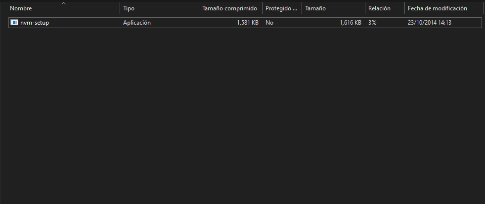
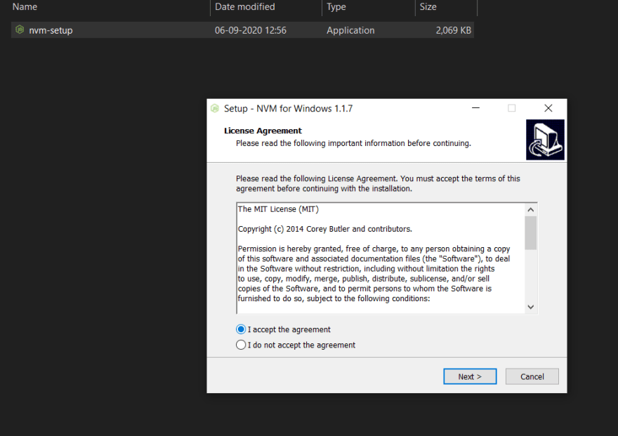
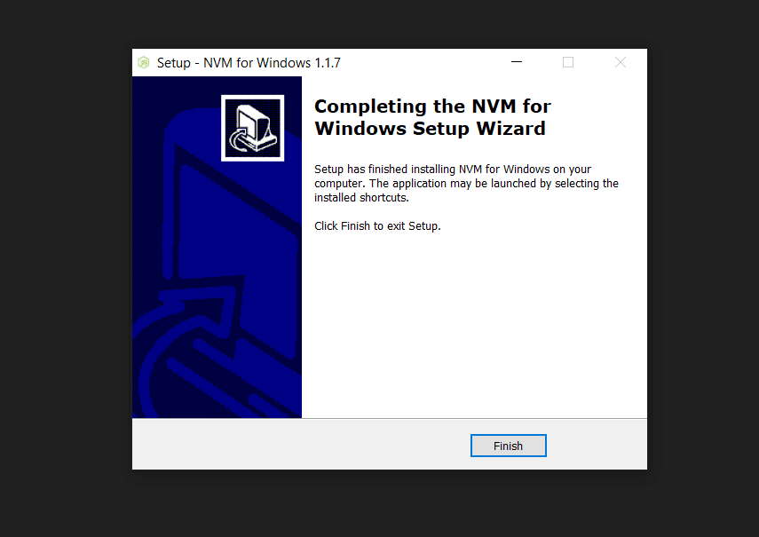

author: Henry Alexander Cortez Amaya
id: HenCor2019-codelab-260921
summary: Codelab acerca de instalación de nvm
tags: workshop, iguide
categories: codelab,markdown
environments: Web
status: Published
feedback link: https://github.com/nvm-sh/nvm/blob/master/README.md
analytics account: Google Analytics ID

# Instalar nvm en diferentes entornos

## Introducción

Duration: 0:05:00

### ¿Qué es NVM?

NVM por sus siglas **_Node Version Manager_** es un administrador de versiones de Node.js

### ¿Por qué NVM?

Node.js es un entorno multiplataforma, lo que conlleva en muchas ocasiones a trabajar con diferentes frameworks que hacen uso de este entorno, por lo cual en mas de una ocasión necesitaremos versiones más actualizadas o pasadas de Node.js. NVM provee una forma sencilla y rápida de manejar estas diferentes versiones para evitarnos el trabajo de desinstalar e instalar la versión de Node.js requerida

### ¿Qué aprenderás?

- Instalar nvm en entornos Unix
- Instalar nvm en Windows
- Instalación manual de nvm para entornos como zhs

## Distribuciones Unix

Duration: 0:15:00

### Acerca de nvm

nvm es un administrador de versiones para Node.js, diseñado para instalarse por usuario e invocarse por shell. nvm funciona en cualquier shell compatible con POSIX (sh, dash, ksh, zsh, bash), en particular en estas plataformas: unix, macOS y windows WSL.

<aside class="positive">
Una de las ventajas de nvm es la facilidad de cambiar entre versiones de Node.js.
</aside>

### Instalación

```console
curl -o- https://raw.githubusercontent.com/nvm-sh/nvm/v0.38.0/install.sh | bash
```

```console
wget -qO- https://raw.githubusercontent.com/nvm-sh/nvm/v0.38.0/install.sh | bash
```

## Instalación en Windows

Duration: 0:10:00

Para lograr obtener nvm para windows debemos ir al siguiente [enlace](https://github.com/coreybutler/nvm-windows/releases) y descargar el archivo **nvm-setup.zip**

Descargamos el archivo, posteriormente lo descomprimimos para finalmente visualizar lo siguiente



Daremos doble click y aceptaremos las condiciones



Luego de la instalaciones podremos ver el siguiente mensaje



Confirmando la instalación de nvm en Windows realizar en el **simbolo del sistema**

```console
nvm --version
```

## Instalación de Node.js

Duration: 0:08:00

Escribir el siguiente comando en la terminal, debemos recibir como respuesta `npm`

```console
command -v nvm
```

### Uso

```console
nvm install node
```

Si deseamos una version especifica de node escribir

```console
nvm install 6.14.4
```

<aside class="negative">
Debemos cambiar 6.14.4 por una version de Node.js de interés
</aside>

## Instalación de npm

Duration: 0:05:00

Verificamos si se ha instalado de manera automática `npm`

```console
npm --version
```

### Instalación manual de npm

```console
nvm install-latest-npm
```

<aside class="positive">
Si se presenta el error "npm does not support Node.js" desinstalar Node.js y ejecutar nvm install --latest-npm
</aside>

## Instalación manual de nvm

Duration: 0:03:00

Agregar las siguientes lineas a nuestro `~/.bashrc`, `~/.profile`, or `~/.zshrc`

```sh
export NVM_DIR="$HOME/.nvm"
[ -s "$NVM_DIR/nvm.sh" ] && \. "$NVM_DIR/nvm.sh" # This loads nvm
[ -s "$NVM_DIR/bash_completion" ] && \. "$NVM_DIR/bash_completion"
```

<aside class="negative">
Esta instalación es recomendable para entornos zsh
</aside>

### Gracias

Gracias por llegar hasta acá, cualquier duda o consulta acerca de esta instalación no dudes en hacerla

